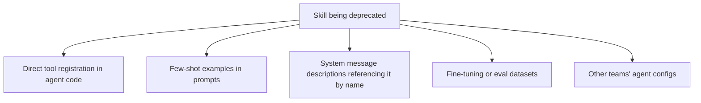

Deprecating a traditional API endpoint means finding every code caller — a solvable, if sometimes tedious, static analysis problem. Deprecating an agent skill means finding every *prompt*, few-shot example, and system message that references it, some of which may live in places static code analysis doesn't reach: a fine-tuning dataset, a stored conversation history a model might retrieve as context, or another team's agent config you don't have visibility into.

## Where Skill References Hide



The last two are the ones that get missed. A fine-tuning dataset built months ago, with examples demonstrating the skill's use, doesn't get automatically flagged by removing the skill's registration — the model may have learned to reach for it regardless of whether it's still registered, producing a tool call that now resolves to nothing.

## A Phased Deprecation, With Signal at Each Stage

```python
class SkillLifecycleState(Enum):
    ACTIVE = "active"
    DEPRECATED_WARNING = "deprecated_warning"  # still works, logs a warning
    DEPRECATED_BLOCKED = "deprecated_blocked"   # returns an error directing to the replacement
    REMOVED = "removed"

def handle_skill_call(skill_name: str, state: SkillLifecycleState, **kwargs):
    if state == SkillLifecycleState.DEPRECATED_WARNING:
        logger.warning(f"Deprecated skill called: {skill_name}")
        return execute_skill(skill_name, **kwargs)
    if state == SkillLifecycleState.DEPRECATED_BLOCKED:
        return {"error": f"{skill_name} has been removed. Use {get_replacement(skill_name)} instead."}
    if state == SkillLifecycleState.REMOVED:
        return {"error": f"{skill_name} does not exist."}
```

The `DEPRECATED_BLOCKED` stage — before full removal — matters specifically because it gives the model a chance to *recover* by reasoning about the error message and trying the suggested replacement, rather than the call simply failing with no path forward. This is a meaningfully softer landing than jumping straight from working to nonexistent.

## Monitor Call Volume Through Each Stage

Removal is safe once call volume on the deprecated skill drops to zero (or an acceptable, understood residual) for a sustained period — not on a fixed calendar timeline decided in advance. A skill still being called meaningfully at the date originally targeted for removal is a signal that some caller hasn't migrated, and removing it anyway breaks something in production.

```python
def is_safe_to_remove(skill_name: str, lookback_days: int = 30, threshold: int = 5) -> bool:
    recent_calls = query_call_volume(skill_name, lookback_days)
    return recent_calls < threshold
```

## Key Takeaways

1. **Skill references live in more places than code** — few-shot examples, fine-tuning data, and other teams' configs are easy to miss
2. **Use a phased lifecycle (active → warning → blocked → removed)**, not an abrupt cutoff
3. **The "blocked" stage gives the model a recoverable error pointing to the replacement**, softer than a call simply failing
4. **Base the final removal date on actual call volume dropping to zero, not a fixed calendar deadline**

---

*Tags: agent skills, deprecation, production, AI engineering*
