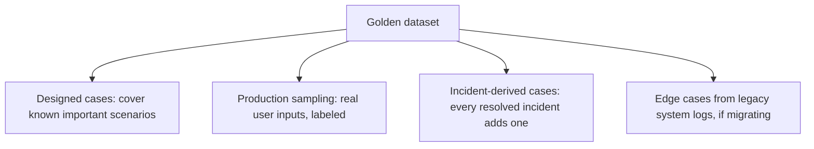

A golden evaluation dataset written entirely from the team's own imagination of what users will ask tends to reflect what the team *expects* usage to look like, which is reliably different from what usage actually looks like once real users are involved. The dataset that catches real regressions has to include real, or realistically messy, examples — not just clean cases someone designed to be answerable.

## Where Golden Examples Should Come From



**Designed cases** ensure explicit coverage of scenarios you know matter even if they're rare in current usage — a new feature with no production history yet, or a known-important edge case that hasn't happened to occur in your sample window.

**Production sampling** is what catches the vocabulary, phrasing, and messiness real users bring that designed cases systematically miss — the wall-of-text question, the ambiguous phrasing, the request that combines two unrelated asks in one message.

**Incident-derived cases**, covered earlier in this series' [postmortem post](/posts/postmortem-format-agent-incidents/), close the loop on real regressions so they can't silently recur.

## Labeling: The Part That Actually Takes Effort

Collecting example inputs is comparatively easy. Labeling each with a correct or acceptable expected output — or, for open-ended tasks, a rubric a judge can score against — is the effortful part, and it's the part that determines whether the eval set is actually useful:

```python
@dataclass
class GoldenExample:
    input: str
    expected_behavior: str  # exact match, or a rubric description for open-ended tasks
    source: str  # "designed" | "production_sample" | "incident" | "legacy_migration"
    difficulty: str  # "easy" | "medium" | "hard" — helps track whether regressions cluster
    added_date: str
```

The `difficulty` field is worth the extra effort to assign — tracking pass rate by difficulty tier over time reveals whether a regression is concentrated in hard cases (often acceptable, or at least lower-urgency) versus easy cases (a real, urgent problem, since those should essentially never fail).

## Size Is Less Important Than Representativeness

Fifty well-labeled, representative examples catch more real regressions than five hundred redundant ones covering the same narrow slice of scenarios. Before adding more examples, check whether the dataset already has good coverage across request types, difficulty levels, and sources — growing the count without growing the diversity mostly just slows down eval runs without improving what they catch.

## Revisit the Dataset as Usage Evolves

A golden dataset built at launch reflects launch-era usage. As the product changes and usage patterns shift, the dataset needs periodic refresh from more recent production samples — otherwise it slowly becomes a test of an outdated understanding of what the system needs to handle well.

## Key Takeaways

1. **Combine designed cases, production samples, and incident-derived cases** — each source catches a different kind of gap
2. **Labeling effort, not collection effort, determines whether the eval set is actually useful**
3. **Track difficulty tier alongside each example** — it reveals whether a regression is urgent or expected
4. **Representativeness matters more than raw size**, and the dataset needs periodic refresh as usage evolves

---

*Tags: agent evaluation, golden dataset, tutorial, AI engineering*
