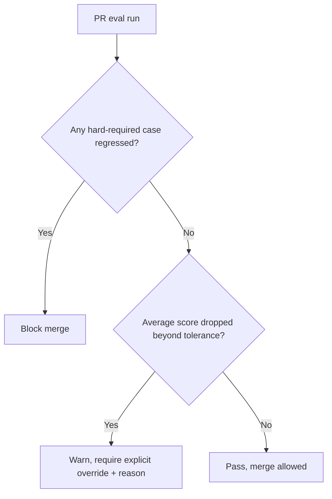

An eval suite that only runs when someone remembers to run it manually — before a "big" prompt or model change — reliably misses the smaller changes nobody thought warranted a manual check: a minor prompt tweak, a dependency bump that changed a library's default behavior, a config change that seemed unrelated to model output quality. CI gating catches all of these the same way, because it doesn't rely on anyone's judgment about which changes are "big enough" to test.

## The Gate, Concretely

```python
# .github/workflows/eval-gate.yml (conceptual)
def eval_gate_check(pr_branch_config, main_branch_baseline) -> dict:
    pr_scores = run_eval_suite(pr_branch_config, golden_dataset)
    baseline_scores = load_baseline_scores(main_branch_baseline)

    regressions = [
        case for case in pr_scores
        if case["score"] < baseline_scores[case["id"]]["score"] - REGRESSION_THRESHOLD
    ]

    return {
        "passed": len(regressions) == 0,
        "avg_score_delta": pr_scores["avg"] - baseline_scores["avg"],
        "regressions": regressions,
    }
```

`REGRESSION_THRESHOLD` matters — a gate with zero tolerance for any score decrease on any case will flag noise from eval nondeterminism (LLM-as-judge scoring isn't perfectly stable run to run) as a false failure constantly, which trains engineers to ignore or bypass the gate. A small tolerance band, calibrated against the observed variance of repeated runs on an *unchanged* config, keeps the gate meaningful.

## What Blocks the Merge, and What Just Warns



Not every regression should hard-block a merge automatically — a small average score drop might be an acceptable tradeoff for a change with other clear benefits, and the engineer making that call should be able to, with visibility into what they're trading off. A defined subset of the eval set (cases covering safety, correctness on core flows) should be hard-blocking; the rest can warn and require an explicit, logged override rather than a silent bypass.

## Keep the Baseline Current

The comparison baseline needs to update to the latest main-branch scores after every merge, not stay frozen at some earlier point — otherwise "regression relative to baseline" drifts from "regression relative to what's actually in production" over time, and the gate starts comparing against a stale reference that no longer reflects reality.

```python
def update_baseline_after_merge(merged_config):
    new_scores = run_eval_suite(merged_config, golden_dataset)
    baseline_store.save(new_scores, timestamp=time.time())
```

## Key Takeaways

1. **Manual eval runs miss the small changes nobody thought to check** — CI gating catches everything uniformly
2. **Calibrate the regression threshold against observed eval nondeterminism**, or a zero-tolerance gate trains engineers to ignore it
3. **Hard-block on safety/core-flow regressions; warn-and-require-override on the rest** — not every regression should be an automatic blocker
4. **Update the baseline after every merge** — a stale baseline compares against a reality that no longer matches production

---

*Tags: agent evaluation, CI/CD, LLMOps, AI engineering*
