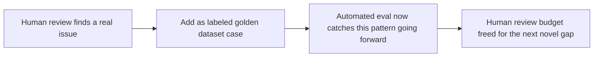

Automated evaluation — deterministic checks and LLM-as-judge scoring — scales to every PR, every deploy, thousands of cases, in a way manual review never can. It also has a real ceiling: an automated judge shares blind spots with the model it's judging (both are LLMs, and both can be fooled by the same kinds of confidently-wrong output), and it can't evaluate genuinely novel failure modes it wasn't designed to detect in the first place.

## What Human Review Catches That Automation Doesn't

- **Novel failure modes** — a new kind of wrong answer the judge rubric was never written to catch, because nobody anticipated it
- **Subtle correctness issues requiring genuine domain expertise** — a technically plausible-sounding answer that's wrong in a way only a subject matter expert would catch
- **Judge-model blind spots** — cases where the automated judge and the model being judged share a systematic bias, agreeing with each other while both being wrong
- **Qualitative dimensions that resist rubric-based scoring** — tone, whether an explanation is genuinely helpful versus technically correct but unhelpful

## Making Human Review Sustainable, Not a Bottleneck

Manual review of every production output doesn't scale past a small volume. The sustainable pattern is targeted sampling, not blanket review:

```python
def sample_for_human_review(requests: list[dict], sample_rate: float = 0.02) -> list[dict]:
    # Weight sampling toward signals that predict a review is worth the time
    weighted = []
    for r in requests:
        weight = 1.0
        if r.get("low_judge_confidence"): weight *= 5
        if r.get("user_gave_negative_feedback"): weight *= 10
        if r.get("novel_request_pattern"): weight *= 3
        weighted.append((r, weight))
    return weighted_sample(weighted, int(len(requests) * sample_rate))
```

Weighting toward low-confidence judge scores, negative user feedback, and novel request patterns means the limited human-review budget concentrates on the cases most likely to reveal something the automated eval missed — not spread evenly across cases where automation is probably already right.

## Close the Loop Back Into Automation



The point of human review isn't to permanently cover the cases it catches — it's to *discover* them once, so they become part of what automated eval covers going forward, freeing the human review budget to keep hunting for the next gap rather than re-reviewing the same category of issue indefinitely.

## Calibrate the Judge Against Human Labels Periodically

If the LLM-as-judge scoring and human reviewers disagree on a meaningful fraction of sampled cases, that's a signal the judge rubric needs recalibration — this periodic comparison is itself a use of human review, and one of the most valuable ones, since a miscalibrated judge silently degrades the value of every automated eval run downstream of it.

## Key Takeaways

1. **Automated eval scales but shares blind spots with the model it judges** — human review catches genuinely novel failure modes
2. **Sample for review, weighted toward low-confidence, negative-feedback, and novel-pattern cases** — blanket review doesn't scale
3. **Every finding from human review should become a labeled golden dataset case**, converting a one-time catch into ongoing automated coverage
4. **Periodically compare judge scores against human labels** — a drifting judge silently degrades every automated eval run

---

*Tags: agent evaluation, human-in-the-loop, LLM-as-judge, AI engineering*
