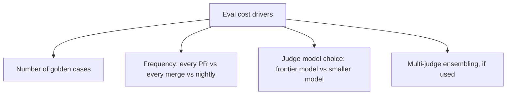

An eval suite of 200 golden cases, scored by an LLM-as-judge, run on every PR — reasonable-sounding on its own, and easy to underestimate as a recurring cost. Run it on every PR, in a team merging a dozen PRs a day, and that's 2,400+ extra LLM calls a day just for evaluation, on top of whatever the system itself costs to run.

## Where the Cost Actually Comes From



The combination of a large case count, a frontier judge model (used because it's the most reliable judge, which is a legitimate reason), and running on every PR rather than a less frequent cadence compounds fast — each factor alone seems reasonable, and multiplied together they produce a number that surprises people the first time they actually total it up.

## Levers That Reduce Cost Without Reducing Coverage

**Tiered eval frequency.** Not every case needs to run on every PR. A fast subset (deterministic checks, no LLM-as-judge calls needed) runs on every PR; the full suite with LLM-as-judge scoring runs on merge to main, or nightly:

```python
EVAL_TIERS = {
    "fast": {"cases": deterministic_cases, "frequency": "every_pr"},       # no LLM calls
    "full": {"cases": all_golden_cases, "frequency": "on_merge"},          # LLM-as-judge included
    "extended": {"cases": all_golden_cases + edge_cases, "frequency": "nightly"},
}
```

**A cheaper judge model for a first pass, escalating to a stronger judge only on ambiguous cases.** A smaller model can reliably distinguish a clearly-passing case from a clearly-failing one; reserve the more expensive judge specifically for cases near the decision boundary, where judgment quality actually matters most.

```python
def two_tier_judge(response: str, criteria: str) -> dict:
    quick_score = cheap_judge.evaluate(response, criteria)
    if quick_score.confidence > 0.85:  # clearly pass or fail
        return quick_score
    return expensive_judge.evaluate(response, criteria)  # ambiguous — escalate
```

**Deterministic checks wherever they can substitute for a judge call at all.** Referenced earlier in this series — if correctness can be verified with a regex, schema validation, or exact match, that's strictly cheaper and more reliable than an LLM-as-judge call, and it should replace one wherever the task actually allows it.

## Budget for This Explicitly, Not as an Afterthought

Eval cost is genuine infrastructure spend and deserves its own line item and its own cost-attribution tracking, the same way any other recurring LLM cost does. Treating it as a rounding error until the first surprising invoice is the actual hidden cost — not the spend itself, but the fact that it wasn't planned for.

## Key Takeaways

1. **Eval suite cost compounds from case count × judge model cost × run frequency** — each factor seems reasonable in isolation
2. **Tier eval frequency** — a fast deterministic subset on every PR, the full LLM-as-judge suite less often
3. **Use a cheaper judge for a first pass, escalating to a stronger judge only on ambiguous cases**
4. **Budget for eval cost explicitly**, with its own attribution — it's real infrastructure spend, not a rounding error

---

*Tags: agent evaluation, cost optimization, LLMOps, AI engineering*
