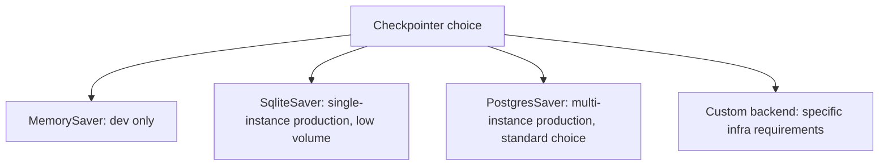

LangGraph's checkpointer persists a graph's state after every node execution, which is what makes durable execution possible — a process restart, a long human-approval wait, or a deliberate pause doesn't lose the agent's progress. The default in-memory checkpointer works for local development and loses everything the moment the process restarts, which makes it the wrong choice for anything beyond a prototype.

## What Gets Checkpointed, Concretely

```python
from langgraph.checkpoint.memory import MemorySaver
from langgraph.checkpoint.postgres import PostgresSaver

# Development only — state is lost on process restart
graph = builder.compile(checkpointer=MemorySaver())

# Production — state survives restarts, deployable across multiple instances
checkpointer = PostgresSaver.from_conn_string(DATABASE_URL)
graph = builder.compile(checkpointer=checkpointer)
```

Every checkpoint captures the full graph state at that point — not just "which node executed" but the actual values in the state object, which is what makes it possible to resume execution from exactly where it left off, including mid-conversation context, partial results from earlier nodes, and any pending human-approval markers.

## Choosing a Checkpointer Backend



For most production deployments, Postgres is the practical default — it supports concurrent access from multiple application instances (necessary the moment you run more than one replica), has mature backup/restore tooling, and the operational team likely already knows how to run it. SQLite works for a genuinely single-instance deployment but breaks down the moment you need to scale horizontally, since it doesn't support the concurrent access multiple instances require.

## Checkpoint Retention Is a Real Decision, Not a Default

Checkpoints accumulate — every node execution across every conversation, indefinitely, if nothing prunes them. This isn't just a storage cost question; old checkpoints for completed conversations rarely need to be resumed, and a retention policy (archive or delete checkpoints for conversations inactive past some window) keeps the checkpoint store from growing unbounded.

```python
def prune_old_checkpoints(checkpointer, inactive_days: int = 90):
    cutoff = datetime.now() - timedelta(days=inactive_days)
    inactive_threads = checkpointer.list_threads(last_active_before=cutoff)
    for thread_id in inactive_threads:
        checkpointer.delete_thread(thread_id)
```

## Checkpointing Enables Time-Travel Debugging

A less obvious benefit: because every intermediate state is persisted, you can inspect the exact state at any prior node for a specific conversation — genuinely useful when debugging a production incident where you need to see exactly what the graph's state looked like right before something went wrong, not just the final output.

## Key Takeaways

1. **The default in-memory checkpointer loses everything on restart** — fine for local dev, wrong for anything else
2. **Postgres is the practical default for production** — multi-instance support and mature operational tooling
3. **Checkpoints accumulate indefinitely without a retention policy** — prune inactive conversation state deliberately
4. **Checkpointing enables time-travel debugging** — inspecting exact intermediate state is a genuine incident-response asset, not just a durability mechanism

---

*Tags: LangGraph, checkpointing, agents, architecture, AI engineering*
