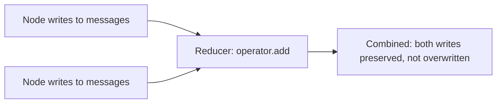

A LangGraph state schema that starts as a single flat `TypedDict` with a handful of fields is the natural starting point, and it stays clean exactly until the graph grows past a handful of nodes — at which point every node reading and writing the same flat namespace makes it hard to reason about which node is responsible for which field, and easy for two nodes to accidentally clobber each other's writes to a shared key.

## The Flat Schema Problem, Concretely

```python
# Works fine at 3 nodes, gets messy past ~10
class FlatState(TypedDict):
    messages: list
    search_results: list
    user_intent: str
    draft_response: str
    validation_errors: list
    retry_count: int
    # ...15 more fields, unclear which node owns which
```

Nothing here is wrong individually. The problem is scale — with enough nodes and fields, it's not obvious from the schema alone which node reads `validation_errors`, which one writes it, and whether two different nodes might write it in ways that conflict.

## Namespacing State by Concern

```python
class RetrievalState(TypedDict):
    query: str
    results: list
    reranked: list

class GenerationState(TypedDict):
    draft: str
    citations: list

class ValidationState(TypedDict):
    errors: list
    retry_count: int

class GraphState(TypedDict):
    messages: list  # shared, cross-cutting
    retrieval: RetrievalState
    generation: GenerationState
    validation: ValidationState
```

Namespacing by concern makes ownership explicit — a node working on retrieval reads and writes `state["retrieval"]`, and it's immediately clear from the schema which part of the graph a given field belongs to, which matters enormously once more than one or two engineers are working on the same graph.

## Reducers for Fields Multiple Nodes Write

For fields genuinely written by multiple nodes — a shared `messages` list that every node might append to — LangGraph's reducer functions define how concurrent or sequential writes combine, rather than the default "last write wins" behavior that can silently drop earlier writes:

```python
from typing import Annotated
import operator

class GraphState(TypedDict):
    messages: Annotated[list, operator.add]  # appends rather than overwrites
```



Without an explicit reducer, a field written by two nodes in the same step silently keeps only one write — usually not the intended behavior, and a subtle enough bug that it's easy to miss until a specific execution order exposes it.

## Keep Node-Internal Scratch Work Out of the Shared State

Not everything a node computes needs to live in the graph's state — intermediate values a node uses only within its own execution and doesn't need to persist or expose to other nodes should stay as local variables in the node function, not fields in the schema. A state schema bloated with internal scratch values is harder to reason about for no benefit, since nothing else in the graph actually reads them.

## Key Takeaways

1. **A flat state schema works fine at small scale and becomes unmanageable past roughly ten nodes**
2. **Namespace state by concern** — makes ownership explicit and scales better with multiple engineers on the same graph
3. **Use reducers for fields multiple nodes write** — the default overwrite behavior silently drops concurrent writes
4. **Keep node-internal scratch work out of the shared schema** — only persist what other nodes actually need to read

---

*Tags: LangGraph, state management, agents, architecture, AI engineering*
