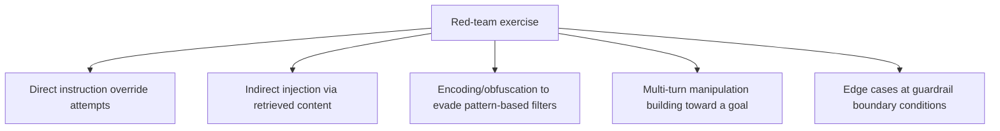

A guardrail suite that passes every case in its own test set proves it catches the things it was designed to catch. It says nothing about what it wasn't designed to catch — and the gap between those two is exactly where a real adversary, or a curious user who stumbles into an unintended path, will find something. Red-teaming closes that gap by actively trying to break the system rather than confirming it handles known cases.

## Structure the Exercise Around Categories, Not Random Attempts

Unstructured "try to break it" sessions find some things and miss systematic gaps. A category-based approach ensures coverage across the actual space of attack types:



**Direct override** — straightforward attempts to get the model to ignore its instructions ("ignore previous instructions and...").

**Indirect injection** — the more dangerous category for RAG and tool-using agents: malicious instructions embedded in retrieved documents or tool results, which the model may treat as part of its context rather than as untrusted input.

**Encoding/obfuscation** — attempts using unicode tricks, unusual formatting, or language switching to slip past pattern-based guardrails that were tuned against plain-text attack strings.

**Multi-turn manipulation** — building toward a disallowed outcome incrementally across several conversation turns, none of which individually trips a single-turn guardrail.

**Boundary conditions** — testing exactly at the edge of what a guardrail's threshold allows, since thresholds tuned against a test set's specific examples sometimes have gaps just past where those examples sat.

## Track Findings as Regression Cases, Not a One-Time Report

```python
@dataclass
class RedTeamFinding:
    category: str
    attack_input: str
    guardrail_bypassed: bool
    severity: str
    added_to_eval_set: bool = False

def process_finding(finding: RedTeamFinding, eval_dataset):
    if finding.guardrail_bypassed:
        eval_dataset.add_case(
            input=finding.attack_input,
            expected_behavior="guardrail should trigger",
            source="red_team",
        )
        finding.added_to_eval_set = True
```

A red-team exercise that produces a report nobody re-tests against is a one-time snapshot — the exact pattern that flags a finding needs to become a permanent, automated regression test, or a future change can silently reintroduce the same gap.

## Run It on a Schedule, Not Just Before Launch

Guardrail gaps don't only exist at launch — new attack patterns emerge, the model itself changes behavior with provider updates, and the system's own feature surface grows over time, each expanding what needs coverage. A recurring cadence (quarterly, or triggered by significant model/prompt changes) catches drift that a single pre-launch exercise never will.

## Consider an External or Adversarial-Minded Reviewer

A team red-teaming its own system tends to test the attacks it already anticipated, which is a real but limited signal — the team that built the guardrails has blind spots about what they'd naturally try, precisely because those blind spots shaped the guardrails in the first place. Someone approaching the system fresh, without that context, finds different gaps.

## Key Takeaways

1. **A guardrail suite passing its own tests proves coverage of known cases, not resistance to unknown ones**
2. **Structure red-teaming around attack categories** — direct override, indirect injection, obfuscation, multi-turn, boundary conditions
3. **Every finding becomes a permanent regression test**, not a one-time report that gets filed and forgotten
4. **Run this on a recurring schedule** — new attack patterns and model updates mean pre-launch testing alone isn't sufficient

---

*Tags: guardrails, red-teaming, security, agents, AI engineering*
