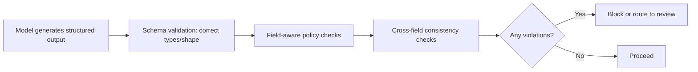

Text-scanning guardrails — profanity filters, PII detectors, prompt-injection classifiers — are built around the assumption that output is prose to be scanned for patterns. A structured output (a JSON object, a function call's arguments) has fields with specific meanings, and a guardrail that only pattern-matches the serialized text misses violations that are only visible once you understand what each field represents.

## What Text-Scanning Guardrails Miss in Structured Output

```json
{
  "action": "issue_refund",
  "amount": 50000,
  "reason": "customer requested"
}
```

A text-scanning guardrail sees a JSON blob with no red-flag words in it — nothing here trips a profanity filter or a PII detector. A field-aware guardrail knows `amount` represents a dollar figure and `action` represents a consequential operation, and can apply a policy check specific to that combination: is $50,000 within the approval threshold for an automatic refund, given the stated reason?

## Field-Aware Validation

```python
def validate_structured_output(output: dict, schema_policies: dict) -> list[dict]:
    violations = []
    for field, policy in schema_policies.items():
        if field not in output:
            continue
        value = output[field]
        if "max_value" in policy and value > policy["max_value"]:
            violations.append({"field": field, "issue": f"exceeds max {policy['max_value']}", "value": value})
        if "allowed_values" in policy and value not in policy["allowed_values"]:
            violations.append({"field": field, "issue": "value not in allowed set", "value": value})
        if "requires_review_above" in policy and value > policy["requires_review_above"]:
            violations.append({"field": field, "issue": "requires human review", "value": value})
    return violations

REFUND_POLICY = {
    "amount": {"max_value": 100000, "requires_review_above": 5000},
    "action": {"allowed_values": ["issue_refund", "deny_refund", "escalate"]},
}
```

This is meaningfully different from a text scan — it's a schema-aware policy check, closer to input validation at an API boundary than to a content filter, and it can catch violations a prose-oriented guardrail structurally cannot see.

## Combine With Cross-Field Consistency Checks

Some violations only appear across multiple fields together, not in any single field alone — a `reason: "duplicate charge"` paired with `action: "deny_refund"` might be internally inconsistent in a way worth flagging even though neither field alone is invalid:

```python
def check_consistency(output: dict) -> list[str]:
    issues = []
    if output.get("reason") == "duplicate charge" and output.get("action") == "deny_refund":
        issues.append("Denying a refund for a duplicate charge is unusual — verify this is intentional")
    return issues
```

## Where This Fits in the Pipeline



Schema validation (does the output match the expected shape and types) is a prerequisite, not a substitute, for field-aware policy checks — a structurally valid output can still violate business policy, and both layers are needed.

## Key Takeaways

1. **Text-scanning guardrails don't understand what a structured output's fields mean** — they can miss violations that are obvious once you know the schema
2. **Field-aware validation applies policy checks specific to what each field represents**, closer to API input validation than content filtering
3. **Some violations only appear as cross-field inconsistencies**, not in any single field's value alone
4. **Schema validation and field-aware policy checks are both necessary** — structurally valid output can still violate business policy

---

*Tags: guardrails, structured outputs, agents, AI engineering*
