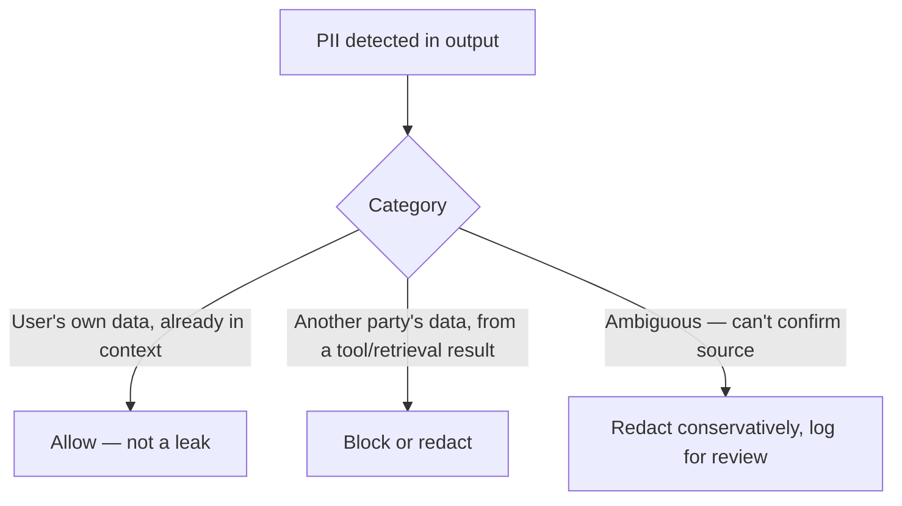

Redacting PII at ingestion — covered earlier on this blog for RAG pipelines specifically — closes one path: PII embedded in indexed documents. It doesn't close every path. A user can paste PII directly into a conversation, a tool call can return PII from a live system that was never indexed, and the model can occasionally infer or hallucinate something that resembles real PII. An output-side guardrail is a distinct, necessary layer, not a redundant one.

## Why This Needs to Be a Separate Check, Not Reused Ingestion Logic

Ingestion-time redaction operates on static documents ahead of time, with room for a slower, more thorough detection pass. Output-time PII checking runs in the response path, under real latency pressure, on content the model just generated — different constraints, and it needs to distinguish between PII that's a genuine leak versus PII the user themselves already provided in the conversation (which isn't a leak, it's the agent correctly using context it was given).

```python
def check_output_pii(response: str, conversation_context: str) -> dict:
    findings = pii_detector.analyze(response)
    genuine_leaks = []
    for finding in findings:
        # Not a leak if the user already provided this exact value in context
        if finding.text not in conversation_context:
            genuine_leaks.append(finding)
    return {"has_leak": len(genuine_leaks) > 0, "findings": genuine_leaks}
```

Without that distinction, an agent correctly confirming a user's own phone number back to them ("I've updated the number ending in 4471") would trip a naive PII filter — a false positive that degrades the product without protecting anyone, since the user already knows their own phone number.

## Different PII Categories Need Different Handling



The middle category — another party's PII surfacing in a response, sourced from a tool call or retrieved document rather than from the current user's own input — is the genuine leak case, and it's exactly the pattern a naive "any PII in output" filter conflates with the harmless first category.

## Latency Budget for This Check

Output-side PII checking runs in the hot path, so it needs to be fast — this is a case where a lightweight pattern-based first pass, escalating to a heavier NER-based check only when the fast pass finds something ambiguous, is a better latency tradeoff than always running the full detection pipeline on every response.

```python
def fast_then_thorough_pii_check(response: str) -> dict:
    quick_hits = regex_pii_scan(response)  # fast, catches well-formatted patterns
    if not quick_hits:
        return {"has_leak": False}
    return check_output_pii(response, conversation_context)  # thorough, only when needed
```

## Key Takeaways

1. **Ingestion-time redaction and output-time PII checking are distinct, both-necessary layers** — they close different leak paths
2. **Distinguish PII the user already provided from another party's PII surfacing from elsewhere** — conflating them produces damaging false positives
3. **Handle categories differently**: allow the user's own data, block another party's, redact-and-log ambiguous cases
4. **Use a fast pattern-based first pass, escalating to thorough NER-based checking only when needed**, to keep this affordable in the hot path

---

*Tags: guardrails, PII, security, agents, AI engineering*
