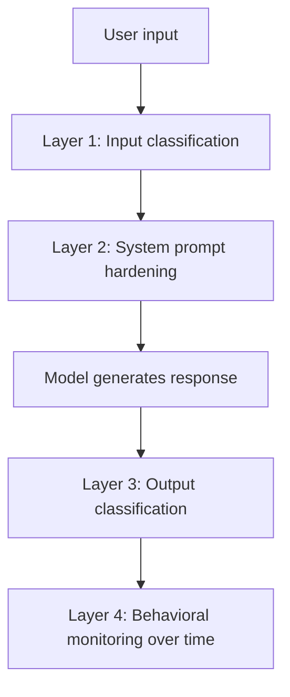

A jailbreak defense built as a single classifier or keyword filter checking user input before it reaches the model has a predictable failure mode: it's a single point that, once bypassed (through obfuscation, translation, roleplay framing, or any of the well-documented jailbreak techniques), leaves the rest of the system with no further check. The patterns that actually hold up under red-teaming layer multiple, independent defenses that don't share the same blind spot.

## The Layers That Compose Well



**Input classification** catches known jailbreak patterns before they reach the model — necessarily incomplete, since new patterns emerge faster than any static classifier can be retrained, but it's a real first filter for known techniques.

**System prompt hardening** — explicit, specific instructions about what the model should refuse and how to recognize manipulation attempts, reducing (not eliminating) the model's own susceptibility, independent of whether the input classifier caught anything.

**Output classification** catches cases where the model was successfully manipulated despite the first two layers — checking what the model actually said, not just what was asked of it, which catches jailbreaks that succeeded at the input stage.

**Behavioral monitoring over time** catches patterns invisible to any single-request check — a user methodically probing different jailbreak techniques across many requests, each individually below any single-request threshold, but forming a clear pattern in aggregate.

## Why Independence Between Layers Matters

```python
def layered_jailbreak_check(user_input: str, model_response: str, user_history: list) -> dict:
    input_flag = input_classifier.check(user_input)          # pattern-based
    output_flag = output_classifier.check(model_response)     # different signal: what model said
    behavioral_flag = check_probing_pattern(user_history)      # different signal: pattern over time

    return {
        "blocked": input_flag or output_flag or behavioral_flag,
        "layer_triggered": [l for l, f in [("input", input_flag), ("output", output_flag), ("behavioral", behavioral_flag)] if f],
    }
```

If all four layers used the same underlying detection approach (say, all pattern-matching against known jailbreak strings), a single novel technique that evades pattern-matching would evade all four simultaneously — the value of layering comes specifically from using genuinely different detection signals, not from redundant copies of the same one.

## Assume Some Jailbreaks Will Succeed, and Limit Blast Radius

No layered defense catches everything — the practical goal is limiting what a successful jailbreak can actually accomplish, not achieving zero successful jailbreaks. This connects to defense patterns covered elsewhere in this series: sandboxed tool execution means a jailbroken model still can't escape its execution boundary; policy-based escalation means even a manipulated model can't authorize a high-value action without a human in the loop. Layered input/output defense reduces jailbreak *frequency*; these structural limits bound jailbreak *impact* when one does succeed.

## Key Takeaways

1. **A single-layer defense has a single point of failure** — red-teaming reliably finds a way around it
2. **Layer input classification, prompt hardening, output classification, and behavioral monitoring** — each catches something the others miss
3. **Layers need genuinely independent detection signals**, not redundant copies of the same approach
4. **Assume some jailbreaks will succeed, and limit blast radius structurally** — sandboxing and policy-based escalation bound impact even when detection fails

---

*Tags: guardrails, jailbreak defense, security, agents, AI engineering*
