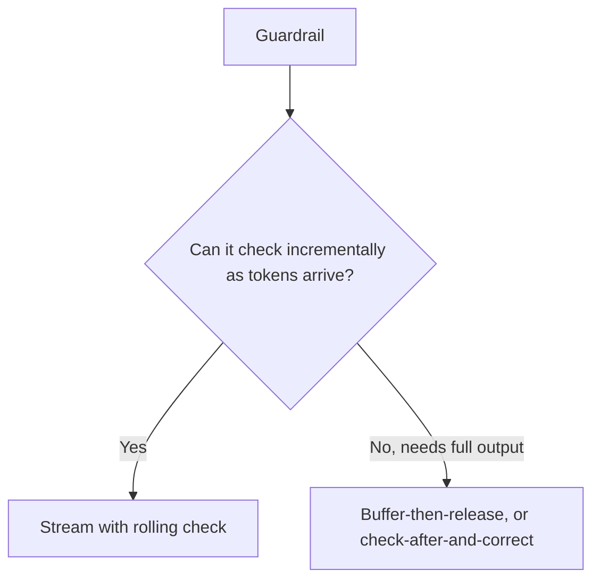

An earlier post in this series covered the streaming-vs-grounding-validation tradeoff specifically for RAG citations. The same tension applies to the full guardrail suite — PII checks, jailbreak output detection, policy compliance — and it's worth working through generally, because each guardrail category has a different answer to "how much can be checked before the user sees it."

## Categorize Guardrails by How They Fit Streaming



**Rolling checks** work incrementally — a PII pattern detector can scan each new chunk of streamed text as it arrives, without needing the full response, flagging and truncating the stream the moment something is detected.

```python
async def stream_with_rolling_pii_check(prompt: str):
    buffer = ""
    async for token in llm.astream(prompt):
        buffer += token
        if pii_detector.quick_scan(token):  # scan just the new chunk
            yield "\n[Response stopped: potential PII detected]"
            return
        yield token
```

**Whole-output checks** genuinely need the complete response — a policy-compliance judge evaluating whether an answer, taken as a whole, satisfies a rubric can't meaningfully evaluate a partial sentence. These require either the buffer-first-sentence compromise from the RAG grounding post, or a full non-streaming path for the specific guardrail categories that need it.

## Not Every Guardrail Needs the Same Treatment

The mistake is treating "streaming" as a single yes/no architectural decision for the whole system. In practice, different guardrail categories can run on different schedules within the same response:

```python
async def guarded_stream(prompt: str, sources: list):
    buffer = ""
    first_sentence_checked = False
    async for token in llm.astream(prompt):
        buffer += token
        # Rolling check: every chunk
        if pii_detector.quick_scan(token):
            yield "[stopped: PII]"
            return
        # Buffered check: first sentence only
        if not first_sentence_checked and buffer.count(".") >= 1:
            if not quick_groundedness_check(buffer.split(".")[0], sources):
                yield "[stopped: ungrounded]"
                return
            first_sentence_checked = True
        yield token
    # Whole-output check: after stream completes, corrects the record if needed
    full_check = policy_judge.evaluate(buffer)
    if not full_check.passed:
        flag_for_review(buffer, full_check)
```

## The Fallback When a Guardrail Trips Mid-Stream

Cutting off a stream abruptly mid-sentence is a jarring user experience, even when it's the correct safety action. A clear, immediate message explaining that the response was stopped — not a silent truncation that looks like a bug — keeps the guardrail action legible to the user rather than looking like the system broke.

## Key Takeaways

1. **The streaming-vs-validation tradeoff applies to the full guardrail suite**, not just RAG groundedness
2. **Categorize guardrails by whether they can check incrementally or need the full output** — they need different treatment
3. **Different guardrail categories can run on different schedules within the same streamed response** — this isn't a single system-wide decision
4. **Make a mid-stream guardrail trip visible and clear to the user**, not a silent, confusing truncation

---

*Tags: guardrails, streaming, agents, AI engineering*
