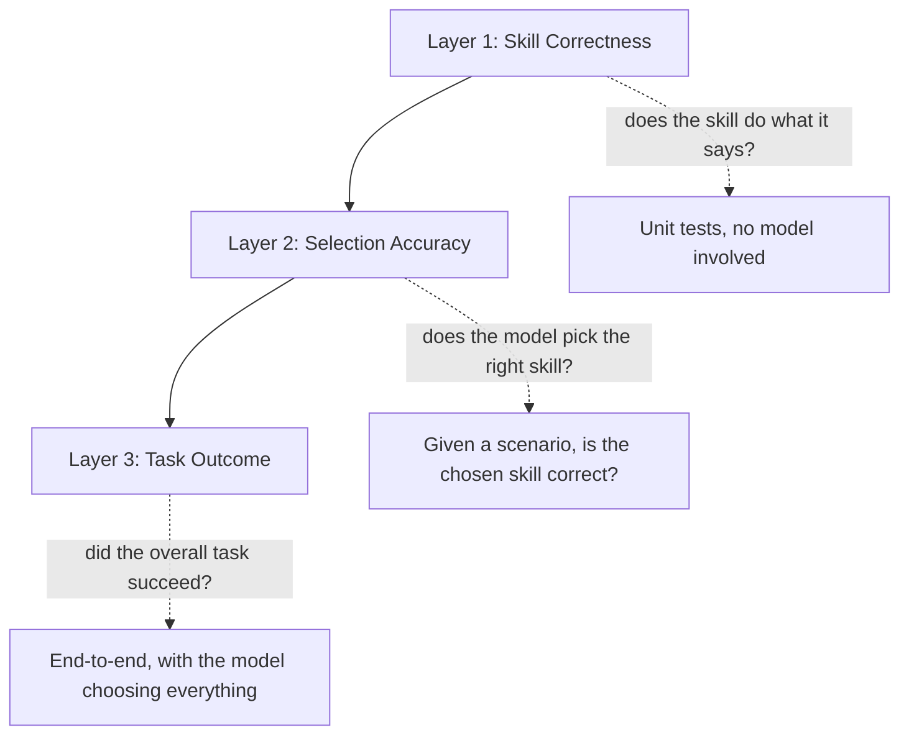

I ended the [last post on skill design patterns](/posts/agent-skill-design-patterns/) saying I'd cover evaluation next — how to know, with actual numbers, whether your skills are performing well enough to trust in production. Here's the framework I use.

The reason skill evaluation needs its own framework, rather than just reusing general LLM eval, is that a skill library fails in three distinct places, and a single end-to-end "did the task succeed" metric can't tell you which one broke.

## The Three Layers



**Layer 1 — Skill correctness**: does the skill function do what its description claims, independent of any model? This is a plain unit test.

**Layer 2 — Selection accuracy**: given a set of available skills and a scenario, does the model pick the right one (or the right sequence)? This is where description quality — [the thing I harped on most in the design patterns post](/posts/agent-skill-design-patterns/) — actually gets measured.

**Layer 3 — Task outcome**: does the full loop, with the model choosing and the skills executing, actually accomplish what the user needed? This is the number that matters to the business, and the hardest one to attribute blame within.

If you only measure Layer 3, a failure could be a bad skill, a bad selection decision, or a bad final synthesis — you won't know which. I learned this the hard way debugging a support agent that kept giving wrong answers; it took two days to realize the skill itself was fine, the model just kept picking `search_knowledge_base` when it should have picked `get_ticket_history`.

## Layer 1: Skill Correctness

Ordinary unit tests, but written against the skill's *contract* — its inputs, outputs, and error format — not its implementation:

```python
def test_get_customer_by_email_returns_normalized_shape():
    result = get_customer_by_email("known@example.com")
    assert result["found"] is True
    assert "customer_id" in result
    assert "account_status" in result  # not "status" — contract matters

def test_get_customer_by_email_handles_missing_gracefully():
    result = get_customer_by_email("nobody@nowhere.test")
    assert result["found"] is False
    assert "message" in result  # actionable, not a bare False

def test_create_ticket_is_idempotent():
    r1 = create_ticket("Login issue", deduplication_key="abc123")
    r2 = create_ticket("Login issue", deduplication_key="abc123")
    assert r1["ticket_id"] == r2["ticket_id"]
    assert r2["created"] is False
```

This layer is cheap to run and should run on every commit. It catches nothing about whether the model uses the skill correctly — that's Layer 2.

## Layer 2: Selection Accuracy

Build a set of scenarios where you know, in advance, which skill (or sequence of skills) *should* be chosen. Run the model against each scenario with the full skill library available, and check what it picked:

```python
selection_scenarios = [
    {
        "input": "What's the status of ticket #4471?",
        "expected_skills": ["get_ticket_by_id"],
    },
    {
        "input": "Has this customer had issues before?",
        "expected_skills": ["get_customer_by_email", "list_customer_tickets"],
    },
    {
        "input": "Find articles about password resets",
        "expected_skills": ["search_knowledge_base"],
    },
]

def evaluate_selection_accuracy(scenarios, agent) -> dict:
    correct = 0
    confusions = []
    for scenario in scenarios:
        result = agent.invoke({"input": scenario["input"]})
        actual_skills = [step.tool for step in result["intermediate_steps"]]
        if actual_skills == scenario["expected_skills"]:
            correct += 1
        else:
            confusions.append({
                "input": scenario["input"],
                "expected": scenario["expected_skills"],
                "actual": actual_skills,
            })
    return {
        "accuracy": correct / len(scenarios),
        "confusions": confusions,  # this list is where the real signal is
    }
```

The `confusions` list is more valuable than the accuracy number. When I look at what gets confused with what, it almost always points at two skill descriptions that overlap — which is a design problem, not a model problem. If `search_knowledge_base` and `get_article_by_id` keep getting swapped, the fix is tightening the descriptions, not a different model.

## Layer 3: Task Outcome

This is the number stakeholders actually care about, and it needs a definition of "success" that's specific to the task, not just "did it produce a plausible-looking response":

```python
def evaluate_task_outcome(golden_tasks: list[dict], agent) -> dict:
    outcomes = {"resolved": 0, "escalated": 0, "failed": 0}
    for task in golden_tasks:
        result = agent.invoke({"input": task["input"]})
        classification = classify_outcome(result, task["success_criteria"])
        outcomes[classification] += 1
    return outcomes

def classify_outcome(result: dict, success_criteria: dict) -> str:
    if success_criteria["type"] == "field_match":
        actual = extract_field(result, success_criteria["field"])
        return "resolved" if actual == success_criteria["expected"] else "failed"
    if success_criteria["type"] == "llm_judge":
        verdict = llm_judge.invoke(
            f"Does this response satisfy: {success_criteria['description']}?\n\n{result['output']}"
        )
        return "resolved" if "yes" in verdict.lower() else "failed"
    return "failed"
```

I use deterministic checks (`field_match`) wherever the task has a verifiable answer, and reserve LLM-as-judge for genuinely open-ended outputs where there's no single correct string to match against. Deterministic checks are more trustworthy and worth the extra setup time whenever they're possible.

## Turning This Into a Regression Suite

The whole point of building this out is catching regressions before they ship — a new skill added to the library, a description tweaked, a model version bumped. I run all three layers in CI and gate merges on Layer 1 and 2 thresholds, with Layer 3 tracked as a dashboard metric rather than a hard gate (it's noisier and slower to run at full scale):

```python
def test_skill_library_regression():
    unit_results = run_layer1_tests()
    assert all(r.passed for r in unit_results)

    selection = evaluate_selection_accuracy(selection_scenarios, agent)
    assert selection["accuracy"] >= 0.90, f"Selection regressed: {selection['confusions']}"
```

## What I Track on an Ongoing Dashboard

| Metric                          | Layer | Alert Threshold          |
| --------------------------------- | ------- | --------------------------- |
| Unit test pass rate                | 1     | Any failure                 |
| Selection accuracy (per scenario set) | 2   | Drop below 90%               |
| Skill confusion pairs (which vs. which) | 2 | New pair appears             |
| Task resolution rate               | 3     | Drop below rolling 7-day average by >5pts |
| Escalation rate                    | 3     | Sudden spike (may mean Layer 1/2 broke) |

A spike in escalation rate is often the first visible symptom of a Layer 1 or 2 regression — the model can't get good results from a broken or misused skill, so it does the safe thing and escalates. Treat an escalation spike as a signal to check the layers below it, not just as "the model got more cautious."

## Key Takeaways

1. **A single end-to-end success metric can't tell you which layer broke** — measure skill correctness, selection accuracy, and task outcome separately
2. **Confusion pairs are more useful than accuracy scores** — they point directly at overlapping descriptions worth tightening
3. **Prefer deterministic checks over LLM-as-judge wherever the task has a verifiable answer** — reserve judge-based scoring for genuinely open-ended outputs
4. **Gate CI on Layers 1 and 2** — they're fast and reliable; track Layer 3 as a dashboard metric since it's noisier and more expensive to run at scale
5. **An escalation-rate spike is often a Layer 1/2 symptom** — check the skill layer before assuming the model just got more conservative
