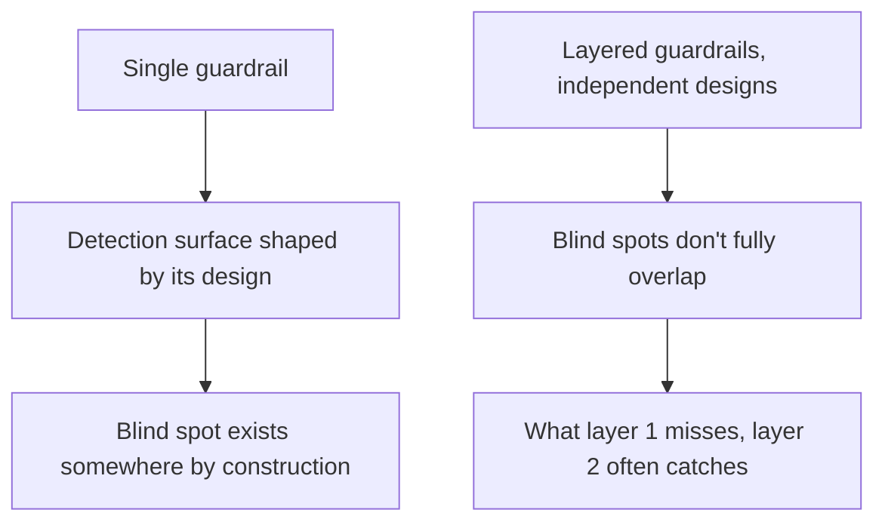

Looking back across the last several posts — jailbreak defense, PII checking, streaming guardrails, red-teaming — the same structural pattern keeps recurring: no single guardrail, however well-tuned, is sufficient on its own. This is worth stating directly rather than leaving implicit, because "add a guardrail" as a response to a discovered gap is a weaker instinct than "which layer should this new check belong to, and what does it add that the existing layers don't already cover."

## Why Single Guardrails Fail as a Category, Not Just in Specific Instances

Every individual guardrail — a classifier, a keyword filter, a rubric-based judge — has a detection surface shaped by how it was built, and every detection surface has blind spots shaped by the same process. A classifier trained on known jailbreak patterns will structurally miss novel ones; a keyword filter trained on English will structurally miss the same content in another language. This isn't a fixable flaw in any individual guardrail — it's an inherent property of any single detection approach, however well-executed.



## The Layering Principle Applied Across This Series

| Guardrail category | Layers that compose |
|---|---|
| Jailbreak defense | Input classification + prompt hardening + output classification + behavioral monitoring |
| PII protection | Ingestion redaction + output-time checking + context-aware leak distinction |
| Structured output safety | Schema validation + field-aware policy checks + cross-field consistency |
| System-level safety | Guardrails (detection) + sandboxing (blast-radius limiting) + escalation (human backstop) |

The last row is the one worth emphasizing: layering isn't only about stacking multiple *detection* mechanisms. Detection and blast-radius limiting are different kinds of layers, and both matter — a jailbreak that evades every detection layer still can't cause damage beyond what sandboxing and policy-based escalation structurally permit.

## The Practical Discipline This Implies

When a new guardrail gap is discovered — through red-teaming, an incident, or a near-miss — the useful question isn't just "what check closes this gap" but "does this belong as a new independent layer, or does it duplicate detection logic an existing layer already covers." Adding redundant copies of the same detection approach gives a false sense of increased coverage without actually shrinking the shared blind spot.

```python
def evaluate_new_guardrail_proposal(proposed_check, existing_layers: list) -> str:
    overlap = [l for l in existing_layers if l.detection_approach == proposed_check.detection_approach]
    if overlap:
        return f"Redundant with {overlap}. Consider strengthening that layer instead of adding a new one."
    return "Adds genuine independent coverage — worth adding as a new layer."
```

## Key Takeaways

1. **Every single guardrail has a blind spot by construction**, not as a fixable flaw — this is true across every category covered in this series
2. **Layering works because independent detection approaches don't share the same blind spot**
3. **Detection layers and blast-radius-limiting layers (sandboxing, escalation) are both necessary** — they solve different problems
4. **Before adding a new guardrail, check whether it's genuinely independent or a redundant copy of existing detection logic**

---

*Tags: guardrails, defense in depth, security, agents, AI engineering*
