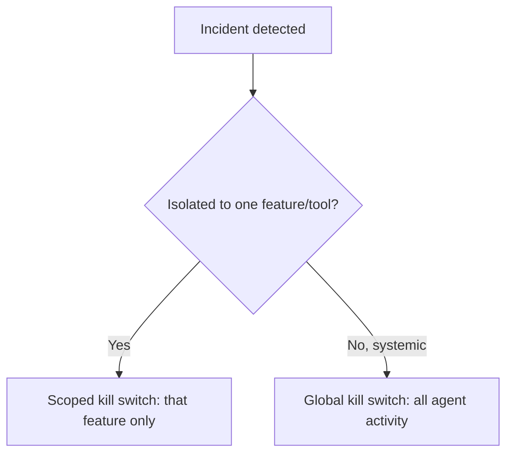

Every layered defense discussed in this series reduces risk; none reduces it to zero. The last-resort control, for the moment something gets through anyway, is a kill switch — a way to stop an agent's actions immediately, system-wide or scoped to a specific feature. Whether it actually works under pressure depends entirely on whether it was designed and tested before the day it's needed, not discovered to be broken in the middle of an actual incident.

## What "Kill" Needs to Actually Mean

A kill switch that only stops *new* requests from starting, while requests already in flight continue to completion, doesn't stop an actively harmful pattern already underway. A genuinely effective kill switch needs to address both:

```python
class AgentKillSwitch:
    def __init__(self):
        self.active = False
        self.scope = None  # None = global, or a specific feature/team identifier

    def activate(self, scope: str = None, reason: str = ""):
        self.active = True
        self.scope = scope
        audit_log.record("kill_switch_activated", scope=scope, reason=reason, actor=get_current_user())
        cancel_in_flight_requests(scope=scope)  # not just block new ones

    def check(self, request_scope: str) -> bool:
        if not self.active:
            return True
        return self.scope is not None and self.scope != request_scope  # scoped kill doesn't block unrelated traffic
```

`cancel_in_flight_requests` matters as much as blocking new ones — an agent mid-execution on a multi-step task, with a kill switch that only prevents new tasks from starting, will still complete whatever it's already doing, which can be exactly the harmful pattern the kill switch was activated to stop.

## Scoped Kill Switches, Not Just Global

A global kill switch is the right tool for a severe, system-wide issue and a blunt, costly instrument for a problem isolated to one feature or team — stopping the entire platform to address a localized issue creates unnecessary collateral impact. Scoped kill switches (per feature, per team, per specific tool) let the response match the actual blast radius of the problem.



## Who Can Activate It, and How Fast

The activation path needs to be fast enough to matter during an actual incident — buried behind a multi-step approval process, a kill switch effectively doesn't exist for the timeframe where it would actually help. On-call engineers need direct activation authority for at least the scoped version, with post-hoc review rather than pre-approval, given the cost of a slow kill switch during a real incident vastly exceeds the cost of an occasional unnecessary activation.

## Test It Like You'd Test a Disaster Recovery Plan

A kill switch that's never been triggered outside a real incident is untested infrastructure — the same discipline that applies to disaster recovery (scheduled drills, not just documentation) applies here. Periodically triggering a scoped kill switch in a controlled way, verifying in-flight requests actually cancel and the system recovers cleanly on deactivation, is what turns "we have a kill switch" into "we know our kill switch works."

## Key Takeaways

1. **A kill switch needs to cancel in-flight work, not just block new requests** — otherwise it doesn't stop an already-underway harmful pattern
2. **Scope kill switches to match actual blast radius** — a global kill switch for a localized problem is an unnecessarily blunt response
3. **Activation needs to be fast and directly available to on-call engineers**, with post-hoc review rather than pre-approval gating it
4. **Test the kill switch periodically, like a disaster recovery drill** — untested emergency infrastructure is a real risk of its own

---

*Tags: kill switch, safety, reliability, agents, AI engineering*
