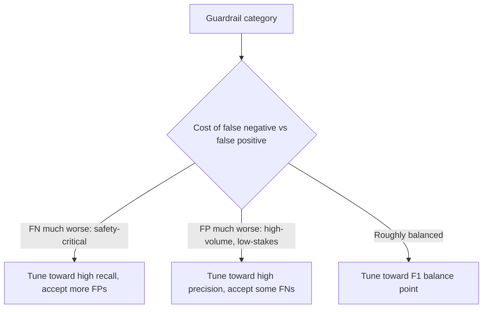

Every guardrail sits on a precision-recall tradeoff, and tuning it purely toward catching everything genuinely bad (minimizing false negatives) means also blocking a meaningful amount of legitimate content (false positives) — a support agent guardrail that blocks any message containing a dollar figure above some threshold, intended to catch suspicious refund requests, will also block a large fraction of completely ordinary, legitimate refund conversations.

## Measure Both Error Types, Not Just One

Teams tend to track false negatives closely (a guardrail failure that let something bad through is visible and alarming) and under-track false positives (a legitimate request incorrectly blocked, which shows up as user frustration, not as a security incident, and is easy to miss without deliberate measurement).

```python
def guardrail_confusion_matrix(labeled_eval_set: list[dict], guardrail) -> dict:
    tp = fp = tn = fn = 0
    for case in labeled_eval_set:
        triggered = guardrail.check(case["input"])
        if case["should_trigger"] and triggered: tp += 1
        elif not case["should_trigger"] and triggered: fp += 1
        elif not case["should_trigger"] and not triggered: tn += 1
        else: fn += 1
    return {
        "precision": tp / (tp + fp) if (tp + fp) else 0,
        "recall": tp / (tp + fn) if (tp + fn) else 0,
        "false_positive_rate": fp / (fp + tn) if (fp + tn) else 0,
    }
```

This requires a labeled eval set with *both* genuine violations and legitimate content that superficially resembles a violation — an eval set with only clear-cut violation examples can't measure false positive rate at all, because it never tests the guardrail against the content most likely to trigger one.

## Where to Set the Threshold Depends on the Stakes



A guardrail protecting against genuinely dangerous output (safety-relevant content, high-value unauthorized actions) reasonably tolerates more false positives in exchange for fewer false negatives — the cost asymmetry justifies it. A guardrail on routine, low-stakes content where false positives directly degrade a high-volume product experience deserves the opposite lean. There's no universally correct threshold; it depends on what specifically is being guarded against.

## Handle False Positives Gracefully, Not Just Rarely

Reducing false positive rate is one lever. The other, often underused, lever is making a false positive less costly when it does happen — a blocked message that clearly explains why and offers a path to human review is a far better experience than a generic "your message could not be processed," even at an identical false positive rate.

```python
def handle_guardrail_trigger(input_text: str, trigger_reason: str) -> dict:
    return {
        "blocked": True,
        "message": f"This message was flagged for review ({trigger_reason}). "
                    "If you believe this is an error, you can request a manual review.",
        "review_available": True,
    }
```

## Re-Tune When the Input Distribution Shifts

A guardrail tuned against one period's traffic distribution can develop a worse false-positive rate months later if the nature of legitimate requests shifts — a new product feature that legitimately involves the kinds of terms the guardrail was watching for, say. Periodic re-measurement against current traffic, not a one-time tuning pass, keeps the tradeoff calibrated to reality.

## Key Takeaways

1. **False positives are systematically under-measured relative to false negatives** — they show up as frustration, not incidents
2. **Measuring false positive rate requires an eval set with legitimate content that superficially resembles a violation**, not just clear violation examples
3. **Where to set the threshold depends on the cost asymmetry for that specific guardrail category** — there's no universal right answer
4. **Reduce the cost of a false positive, not just its frequency** — a clear explanation and review path matters at any given rate

---

*Tags: guardrails, false positives, tuning, AI engineering*
