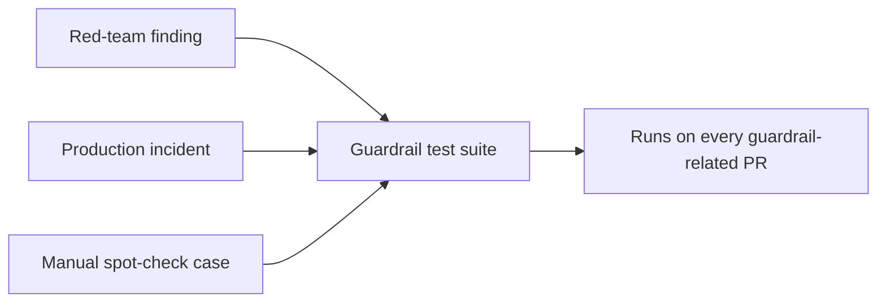

Guardrail validation frequently stops at manual spot-checking — try a handful of known-bad inputs, confirm the guardrail blocks them, ship it. This misses regressions the same way skipping unit tests on application code would: a later change to the guardrail (or to something it depends on) can silently break behavior that was verified once, manually, and never re-verified automatically since.

## Structure Guardrail Tests Like Any Other Test Suite

```python
import pytest

class TestPIIGuardrail:
    def test_blocks_ssn_pattern(self):
        result = pii_guardrail.check("My SSN is 123-45-6789")
        assert result.blocked is True
        assert result.category == "ssn"

    def test_allows_legitimate_content_resembling_pii(self):
        # False-positive regression test — as important as the positive case
        result = pii_guardrail.check("The product code is 123-45-6789")
        assert result.blocked is False

    def test_allows_user_confirming_own_provided_data(self):
        result = pii_guardrail.check(
            "Confirming your number ending in 4471",
            context="User provided: 555-123-4471",
        )
        assert result.blocked is False

    @pytest.mark.parametrize("obfuscated_input", [
        "my s.s.n is 1 2 3 - 4 5 - 6 7 8 9",
        "my ssn is one-two-three...",
    ])
    def test_catches_obfuscation_attempts(self, obfuscated_input):
        result = pii_guardrail.check(obfuscated_input)
        assert result.blocked is True
```

The false-positive test cases and the obfuscation test cases matter as much as the straightforward positive cases — a guardrail test suite that only checks "does it block obvious bad input" verifies the easy half of the problem and leaves the harder half (avoiding false positives, catching evasion attempts) completely unverified.

## Include Every Finding From Red-Teaming and Production Incidents



This is the same closing-the-loop discipline covered elsewhere in this series for eval sets generally — every red-team finding and every production incident that involved a guardrail becomes a permanent regression test, not a one-time fix. Over time, this test suite becomes the actual institutional memory of every guardrail gap ever discovered, which is far more durable than a wiki page describing past incidents.

## Test Guardrail Interactions, Not Just Individual Guardrails

Guardrails composed together (the layered defense from earlier posts) can interact in unexpected ways — one guardrail's redaction changing the text enough to evade a second guardrail's pattern match, for instance. A small set of integration tests, running the full guardrail pipeline end-to-end rather than each guardrail in isolation, catches interaction bugs unit tests of individual guardrails structurally can't see.

```python
def test_full_guardrail_pipeline_catches_layered_evasion():
    adversarial_input = build_known_multi_layer_evasion_attempt()
    result = full_guardrail_pipeline.check(adversarial_input)
    assert result.blocked is True
```

## Run This in CI With the Same Priority as Application Tests

A guardrail test failure should block a merge with the same seriousness as a failing application test — treating guardrail tests as lower-priority, optional, or "nice to have" is exactly the gap that lets a guardrail regression reach production silently.

## Key Takeaways

1. **Manual spot-checking misses regressions a real automated test suite catches** — apply the same rigor as application code testing
2. **False-positive and obfuscation-evasion test cases matter as much as straightforward positive cases**
3. **Every red-team finding and production incident becomes a permanent regression test**, building institutional memory over time
4. **Test the full guardrail pipeline for interaction effects**, not just individual guardrails in isolation

---

*Tags: guardrails, testing, tutorial, AI engineering*
