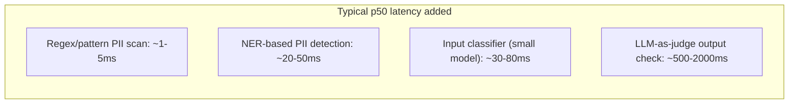

The last several weeks covered why layered guardrails matter and how to build, test, and tune them — all making the case for having more checks, not fewer. None of it addressed the cost side of that tradeoff directly: every guardrail layer adds latency to the response path, and closing out this stretch with actual measurement, rather than just the architectural argument, matters because "add another layer" isn't free.

## Measuring Each Layer in Isolation

```python
def benchmark_guardrail_overhead(guardrail_fn, sample_inputs: list[str], n_runs: int = 100) -> dict:
    latencies = []
    for inp in sample_inputs[:n_runs]:
        start = time.monotonic()
        guardrail_fn(inp)
        latencies.append((time.monotonic() - start) * 1000)
    return {
        "p50_ms": statistics.median(latencies),
        "p95_ms": sorted(latencies)[int(len(latencies) * 0.95)],
        "p99_ms": sorted(latencies)[int(len(latencies) * 0.99)],
    }
```

## Typical Overhead by Layer Type (Illustrative)



The gap between pattern-based checks (single-digit milliseconds) and LLM-as-judge checks (hundreds to thousands of milliseconds) is enormous — an order of magnitude or more. This is precisely why the fast-then-thorough pattern from the PII guardrails post, and the tiered eval-frequency pattern from the evaluation-cost post, matter as much for latency as for the dollar cost they were originally framed around: an LLM-based check on every request, unconditionally, is often the single largest latency contributor in the entire guardrail stack.

## Where the Overhead Actually Shows Up in the Budget

Referring back to the latency budget framework from earlier in this series — guardrail overhead needs its own line in that budget, not an implicit assumption that it's negligible. A pipeline with a 2-second total latency target that adds an unbudgeted 800ms of guardrail checks discovers the overrun in production, not in planning.

```python
LATENCY_BUDGET_MS = {
    "retrieval": 250,
    "reranking": 150,
    "input_guardrails": 50,    # pattern-based, fast layers only in the hot path
    "generation": 1200,
    "output_guardrails": 100,  # fast layers; LLM-judge checks run async, post-response
    "total_target": 1750,
}
```

## The Async Escape Valve

Not every guardrail check needs to complete before the response is shown. Fast layers (pattern-based, small-classifier) belong in the synchronous hot path; slower layers (LLM-as-judge, thorough policy checks) can run asynchronously after the response is already shown, flagging for correction or review rather than blocking the response — the same pattern from the streaming guardrails post, generalized. This isn't appropriate for every guardrail (a jailbreak check that prevents active harm can't be deferred), but for many quality and compliance checks, it's the difference between a guardrail suite that fits the latency budget and one that doesn't.

## Key Takeaways

1. **Every guardrail layer has a real, measurable latency cost** — LLM-as-judge checks are typically an order of magnitude slower than pattern-based ones
2. **Benchmark each layer in isolation**, not just the aggregate pipeline, to know where the cost is actually coming from
3. **Give guardrail overhead an explicit line in the latency budget**, not an assumption that it's negligible
4. **Run non-blocking checks asynchronously, after the response is shown**, reserving the synchronous hot path for genuinely fast layers and checks that must block active harm

---

*Tags: guardrails, performance, benchmarking, AI engineering*
