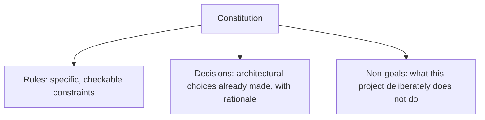

A constitution doc — the foundational, persistent set of constraints an agentic coding session is meant to operate under — fails the same way any other prompt fails when it's vague: broad, aspirational language ("write clean, maintainable code") gives the model nothing concrete to check its own output against, and it gets treated as background flavor rather than a real constraint.

## Specific and Checkable, Not Aspirational

```markdown
## Weak (aspirational, unenforceable)
- Write clean, maintainable code
- Follow best practices
- Consider performance

## Strong (specific, checkable)
- All public functions require type hints and a one-line docstring
- No function exceeds 40 lines; extract a helper if it does
- Database queries in a request path must use the existing connection
  pool (`db.pool`), never a fresh connection
- New API endpoints require an OpenAPI schema entry in `openapi.yaml`
  before merge
```

The weak version can't be verified — "clean" isn't checkable by the agent or by a reviewer without shared, specific criteria for what that means. The strong version can be checked mechanically, by the agent itself during self-review or by a lint rule, which is what actually makes it enforceable rather than aspirational.

## Structure Around Decisions, Not Just Rules



Rules alone tell an agent what to avoid. **Decisions** — "we use PostgreSQL, not MongoDB, because X; we use REST, not GraphQL, because Y" — prevent the agent from re-litigating settled architectural choices on every session, which is a common and time-wasting failure mode without an explicit record of what's already been decided and why. **Non-goals** are equally valuable and often omitted: explicitly stating what the project doesn't try to do prevents scope creep an agent might otherwise introduce with good intentions.

## Keep It Short Enough to Actually Stay in Context

A 20-page constitution doc, even if every line is specific and checkable, competes for context budget against the actual task at hand, and long documents suffer from the same context-rot issues covered in this blog's [context engineering post](/posts/context-engineering-replacing-prompt-engineering/) — buried constraints get followed less reliably than prominent ones. Keep the constitution to the constraints that actually matter enough to enforce on every session, and push detailed, situational guidance into steering documents referenced only when relevant.

## Version It Like Any Other Spec Artifact

The constitution changes as a project evolves — new constraints get added, old ones get relaxed once their reason no longer applies. Version it in the same repository, reviewed through the same PR process as code, so there's a record of when and why a constraint changed — this becomes especially important months later when someone questions whether a constraint is still needed.

## Key Takeaways

1. **Specific, checkable constraints get followed; aspirational language gets treated as flavor text**
2. **Record decisions and non-goals alongside rules** — prevents re-litigating settled choices and scope creep alike
3. **Keep the constitution short enough to stay prominent in context** — push situational detail into referenced steering docs instead
4. **Version the constitution in the repo with PR review**, same as any other artifact that shapes agent behavior

---

*Part of the [Spec-Driven Development series](/tags/sdd-series/) — how agentic coding goes from vibe-coded prototypes to production-grade systems.*
