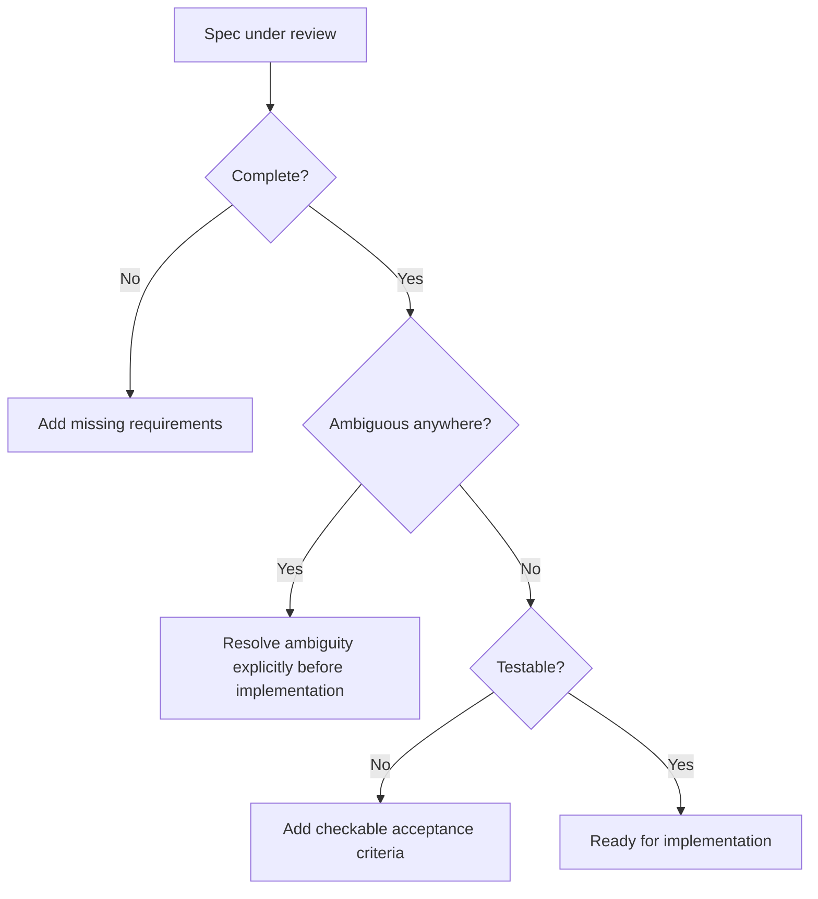

Reviewing a spec before an agentic coding tool implements it against that spec is dramatically cheaper than reviewing the resulting code afterward — a gap in the spec produces a gap in the implementation, and catching it before implementation starts avoids the far more expensive cycle of implement, review, discover the gap, and redo. That only holds if the spec review actually checks for the failure modes specs have, not just "does this read clearly."

## The Checklist

```markdown
## Completeness
- [ ] Every user-facing behavior change is described, not just the "happy path"
- [ ] Error and edge cases are specified, not left to agent inference
- [ ] Non-functional requirements are explicit (performance, security, compatibility)

## Ambiguity
- [ ] No requirement uses vague quantifiers ("fast," "scalable") without a
      concrete definition
- [ ] Terms with multiple possible interpretations are defined once, consistently

## Testability
- [ ] Every requirement maps to at least one way it could be verified
- [ ] Acceptance criteria are stated as checkable conditions, not aspirations

## Scope
- [ ] What's explicitly out of scope is stated, not just what's in scope
- [ ] The spec doesn't silently assume changes to systems outside its stated scope

## Consistency
- [ ] No requirement contradicts another requirement in the same spec
- [ ] No requirement contradicts an existing constitution rule or prior decision
```

## Why "Ambiguity" Deserves Its Own Category

A spec can be complete (covers every case) and still ambiguous (each case is described in a way that admits multiple reasonable implementations) — these are different failure modes requiring different fixes. An agent implementing an ambiguous-but-complete spec will make a reasonable choice at each ambiguous point, and "reasonable" from the agent's perspective doesn't guarantee it matches what the spec's author actually intended.



## Review the Spec Against the Constitution, Not Just Internally

A spec can be internally consistent and still conflict with an established constitution decision — proposing a new database technology when the constitution already settled on one, for instance. This check requires the reviewer to actually know the constitution's content, which is a good argument for keeping the constitution short enough (from the previous post) that reviewers can hold it in mind.

## Who Should Run This Checklist

Ideally not just the same person who wrote the spec — a second reviewer catches ambiguity the author is blind to precisely because the author already knows what they meant, which is exactly the knowledge an implementing agent won't have. Where a second human reviewer isn't practical for every spec, having the agent itself attempt to restate the spec in its own words before implementing is a lightweight substitute that surfaces some ambiguity the author can then catch.

## Key Takeaways

1. **Spec review is far cheaper than code review for catching the same underlying gap** — but only if it checks for spec-specific failure modes
2. **Completeness and ambiguity are distinct failure modes** — a spec can have one without the other, and both need separate checks
3. **Check the spec against the constitution**, not just for internal consistency
4. **A second reviewer, or an agent restating the spec back, surfaces ambiguity the original author is structurally blind to**

---

*Part of the [Spec-Driven Development series](/tags/sdd-series/) — how agentic coding goes from vibe-coded prototypes to production-grade systems.*
