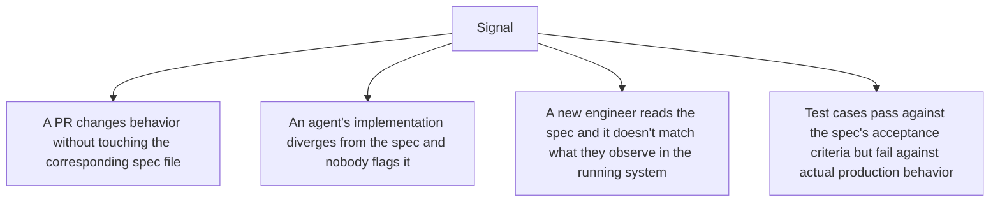

The moment a spec is written and implemented, it starts drifting from reality — not through any single dramatic event, but through the accumulation of small follow-up changes (a bug fix that adjusts behavior slightly, a "quick" feature addition, a refactor that changes an implementation detail the spec had documented) that don't get reflected back into the spec. Individually, each drift is trivial. In aggregate, the spec becomes a document describing a system that no longer quite exists, and its value as a source of truth erodes with every un-reflected change.

## Why This Matters More for Agentic Coding Than It Did Before

A spec-driven workflow relies on the spec as ground truth for what an agent should build or modify next. If the spec has drifted from the actual codebase, an agent implementing "consistent with the spec" is implementing consistent with a description of a system that no longer matches what's actually deployed — producing changes that are locally correct against the spec and globally wrong against reality.

## Signals That Indicate Drift



The first signal is the most actionable, because it's detectable automatically:

```python
def flag_potential_drift(pr_diff, spec_files: dict) -> list[str]:
    """Flag when a PR changes behavior-relevant code without touching the spec."""
    warnings = []
    for changed_file in pr_diff.changed_files:
        affected_spec = find_spec_covering(changed_file, spec_files)
        if affected_spec and affected_spec not in pr_diff.changed_files:
            warnings.append(f"{changed_file} changed, but {affected_spec} was not updated — possible drift")
    return warnings
```

This isn't a perfect signal — not every code change to a spec-covered file represents a behavior change the spec needs to reflect — but as a prompt for a reviewer to explicitly confirm "yes, this doesn't affect the spec" or "actually, update the spec," it catches drift far earlier than discovering it months later when someone tries to use the spec and finds it wrong.

## Periodic Spec Audits, Not Just Change-Triggered Checks

Change-triggered detection catches drift introduced by tracked code changes. It won't catch drift from things outside the tracked diff — a config change, an infrastructure change, a manual production hotfix. A periodic audit (quarterly, or triggered by a major release) where someone deliberately re-reads each spec against the current running system's actual behavior catches what change-triggered detection structurally can't.

## Treat a Drifted Spec as a Bug, Not a Documentation Nicety

The instinct to deprioritize "the spec is out of date" relative to feature work treats spec accuracy as a documentation nicety rather than what it actually is in a spec-driven workflow — a correctness dependency for every future agent session that reads it. A drifted spec isn't stale documentation; it's an input that will actively mislead the next agentic coding session that trusts it.

## Key Takeaways

1. **Spec drift accumulates from many individually-trivial un-reflected changes**, not one dramatic event
2. **In a spec-driven workflow, a drifted spec actively misleads future agent sessions**, not just human readers
3. **Automated detection (behavior-relevant code changed, spec didn't) catches drift early**, though it needs human judgment to confirm
4. **Periodic audits catch drift outside tracked code changes** that automated detection structurally can't see

---

*Part of the [Spec-Driven Development series](/tags/sdd-series/) — how agentic coding goes from vibe-coded prototypes to production-grade systems.*
