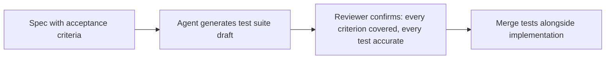

A spec written with testable acceptance criteria (the standard from the [spec review checklist](/posts/spec-review-checklist-agentic-coding/) earlier in this series) contains most of the information needed to write the corresponding test suite. Writing tests separately, from memory, after implementation is complete, both duplicates that information and risks the tests reflecting what the implementation *actually does* rather than what the spec *specified* — silently validating a bug as correct behavior if the implementation and the spec have quietly diverged.

## From Acceptance Criteria to Test Cases, Directly

```markdown
## Spec: Password reset token expiry
- A password reset token expires 15 minutes after issuance
- An expired token returns a 410 Gone with message "Reset link expired"
- Using a token twice returns a 410 Gone with message "Reset link already used"
- A valid, unused, unexpired token successfully resets the password
```

```python
class TestPasswordResetTokenExpiry:
    def test_valid_token_resets_password(self):
        token = issue_reset_token(user)
        response = reset_password(token, new_password="...")
        assert response.status_code == 200

    def test_expired_token_returns_410(self):
        token = issue_reset_token(user, issued_at=now() - timedelta(minutes=16))
        response = reset_password(token, new_password="...")
        assert response.status_code == 410
        assert response.json()["message"] == "Reset link expired"

    def test_reused_token_returns_410(self):
        token = issue_reset_token(user)
        reset_password(token, new_password="...")  # first use, succeeds
        response = reset_password(token, new_password="...")  # second use
        assert response.status_code == 410
        assert response.json()["message"] == "Reset link already used"
```

Each test traces directly to one bullet in the spec — a reviewer (or an agent) can verify test coverage by checking each spec line has a corresponding test, and verify each test is justified by checking it traces back to a spec line, rather than either check requiring independent judgment about what "enough coverage" means.

## Let the Agent Generate the First Draft, Review the Mapping

Given a spec with checkable acceptance criteria, having the coding agent generate the initial test suite draft directly from those criteria is a reasonable and efficient use of agentic coding — mechanical translation from stated criteria to test code is exactly the kind of task agents handle well. The review step that matters isn't re-deriving the tests independently; it's confirming the mapping is complete and accurate — every criterion has a test, and every test actually tests what it claims to.



## What This Doesn't Replace

Spec-derived tests verify behavior the spec explicitly states. They don't replace exploratory testing, property-based testing for invariants the spec didn't think to state explicitly, or testing for failure modes outside the spec's scope entirely (a dependency being unavailable, for instance, unless the spec specifically addresses that). Spec-driven testing is the floor — the guaranteed-covered baseline — not the ceiling of what a real test suite should include.

## Key Takeaways

1. **A spec with checkable acceptance criteria contains most of the information needed for its own test suite**
2. **Deriving tests directly from spec criteria avoids tests silently reflecting implementation bugs as correct behavior**
3. **Agent-generated first-draft tests, reviewed for completeness of the criteria-to-test mapping, are an efficient and reasonable workflow**
4. **Spec-derived tests are a floor, not a ceiling** — exploratory and property-based testing still cover what the spec doesn't state explicitly

---

*Part of the [Spec-Driven Development series](/tags/sdd-series/) — how agentic coding goes from vibe-coded prototypes to production-grade systems.*
