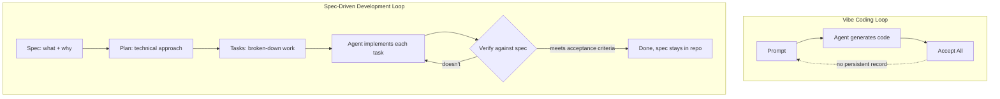

Andrej Karpathy named the thing most of us were already doing back in early 2025: describing what you want in plain English, letting an agent generate the code, and — his words — "fully give in to the vibes." No reading diffs, no reviewing line-by-line, just prompting and accepting. It's a genuinely useful mode. It's also the mode that quietly breaks the moment a prototype turns into something people depend on.

This post opens a short series on **spec-driven development (SDD)** — what changes when the spec, not the prompt, becomes the unit of work an agentic coding tool operates against. I'll cover two concrete implementations of this idea — [GitHub's Spec-Kit](/posts/github-spec-kit-practical-guide/) and [AWS's Kiro](/posts/kiro-ide-specs-steering-hooks/) — a comparison between them, and a [playbook for migrating an existing vibe-coded project](/posts/vibe-coding-to-sdd-migration-playbook/) toward this discipline without a full rewrite. First, though, it's worth being precise about why vibe coding specifically stops working once an *agent* — not just an autocomplete — is the one writing most of the code.

## Vibe Coding Works Great, Until It Doesn't

For a throwaway script, a weekend prototype, or exploring whether an idea is even worth building, vibe coding is close to optimal. You don't know the shape of the final system yet, so investing in a formal spec is wasted effort — the fastest path to learning whether the idea works is to describe it and see what comes out.

The trouble starts when that prototype survives past its first week, because the properties that made vibe coding fast are exactly the properties that make it fragile at scale:

- **No persistent source of truth.** The requirements exist only as scattered messages in a chat history — not versioned, not searchable, not something a new agent session (or a new team member) can read to understand *why* the code looks the way it does.
- **Context doesn't survive across sessions.** Every new agent session re-derives architecture decisions from whatever it can infer from the existing code, which drifts further from the original intent with each iteration.
- **Review discipline erodes.** "Accept All" is efficient right up until it isn't — bugs, security gaps, and inconsistent patterns accumulate invisibly because nobody's reading the diffs closely enough to catch them.
- **Nothing to verify against.** Without a spec, "is this correct" collapses into "does this look right," which is a much weaker bar and one an agent can satisfy while still being wrong.

None of these are really about code quality in the moment — a vibe-coded feature can look perfectly reasonable in isolation. They're about what happens as the *number* of features and agent sessions grows, and there's no artifact anywhere holding the system's intent steady across all of them.

## What Spec-Driven Development Changes

SDD doesn't remove the agent from the loop — it changes what the agent is working *from*. Instead of a prompt that exists only in a chat buffer, the agent reads and writes against a spec that's checked into the repository: versioned, reviewable, and durable across however many sessions it takes to build the feature.

The critical difference isn't ceremony for its own sake — it's that the spec becomes something a *different* agent session, a *different* coding tool, or a *human reviewer* can all read independently and arrive at the same understanding of what the system is supposed to do. That's the property vibe coding structurally cannot provide, because its only artifact is code that already reflects a decision, with no record of what the decision actually was.

## Two Concrete Implementations

This idea isn't hypothetical — two tools take genuinely different approaches to it, and the rest of this series covers both in depth:

- **[GitHub Spec-Kit](/posts/github-spec-kit-practical-guide/)** is an open-source, agent-agnostic toolkit — a CLI plus a set of slash commands (`/speckit.constitution`, `/speckit.specify`, `/speckit.plan`, `/speckit.tasks`, `/speckit.implement`) that you layer onto whichever coding agent you're already using — GitHub Copilot, Claude Code, Gemini CLI, or others.
- **[Kiro](/posts/kiro-ide-specs-steering-hooks/)** is AWS's agentic IDE, where spec-driven development isn't an add-on — it's the default workflow the whole product is built around, down to using a formal requirements notation borrowed from aerospace engineering.

## Vibe Coding vs. SDD: The Practical Differences

| Dimension                  | Vibe Coding                          | Spec-Driven Development                    |
| ---------------------------- | --------------------------------------- | ---------------------------------------------- |
| **Speed to first prototype**  | Fastest possible                       | Slower — upfront spec investment                |
| **Persistent source of truth** | None — lives in chat history           | Yes — versioned spec/requirements in the repo   |
| **Cross-session consistency**  | Drifts each session                    | Anchored to the same spec every session         |
| **Review discipline**          | Erodes ("Accept All")                  | Diffs reviewed against acceptance criteria      |
| **Verifiability**              | "Does it look right?"                  | "Does it meet the spec?"                        |
| **Best for**                   | Prototypes, spikes, throwaway scripts  | Production features, multi-session builds, teams |

## When Vibe Coding Is Still the Right Call

None of this is an argument that vibe coding is bad — it's an argument that it's scoped wrong when applied past its useful range. Vibe coding remains the right tool when you're validating whether an idea is worth building at all, writing a script you'll run once, or exploring a design space before you know enough to write a spec that would mean anything. The overhead of a constitution, a requirements doc, and a task breakdown isn't worth paying until you're reasonably confident the thing you're building is going to stick around.

## Key Takeaways

1. **Vibe coding's speed comes from having no persistent artifact** — which is also exactly why it doesn't scale past a single session or a single throwaway use
2. **Agentic coding tools specifically need a durable spec**, because unlike a human who retains context between sessions, an agent's only memory of "why" is whatever's written down
3. **The spec, not the prompt, becomes the unit of work** in SDD — plan, tasks, and code all trace back to it
4. **Two real tools take different paths to this** — Spec-Kit layers onto your existing agent, Kiro builds an IDE around the workflow itself
5. **Match the tool to the stage** — vibe code the prototype, spec the production feature

---

*Part of the [Spec-Driven Development series](/tags/sdd-series/) — how agentic coding goes from vibe-coded prototypes to production-grade systems.*
