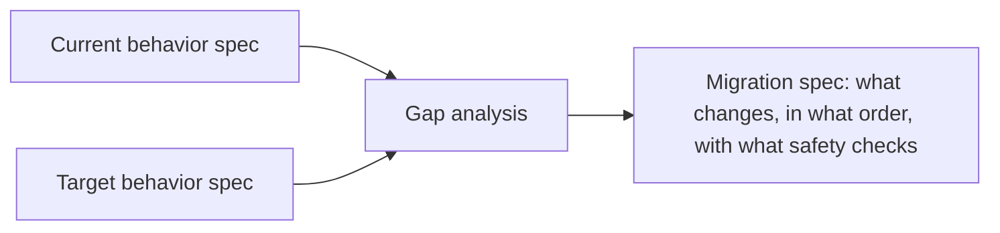

Every worked example of spec-driven development — including most of the ones earlier in this series — implicitly assumes greenfield work: describe the thing you want, an agent builds it. A legacy migration has a different starting condition: there's an existing system with behavior nobody fully documented, and the spec needs to capture what that system *actually does* before it can specify what the target system should do instead.

## Two Specs, Not One



**Current behavior spec** documents what the existing system actually does — not what its original design intended, but its real, possibly-drifted-from-spec behavior, including the undocumented edge cases and quirks that downstream systems have come to depend on, intentionally or not.

**Target behavior spec** describes the destination, the same way a greenfield spec would.

**Migration spec** is the part unique to this scenario: what changes, in what order, with what verification at each step that the system still behaves correctly for anything not yet migrated.

## Documenting Current Behavior Is Its Own Real Effort

For a legacy system with no accurate existing documentation, reconstructing the current-behavior spec is often the most time-consuming part of the whole migration — more so than writing the target spec, which is comparatively easy since it's describing something not yet built. An agentic coding tool can help here in a specific, bounded way: given the legacy codebase, generate a draft behavior spec by tracing actual code paths, which a human then verifies against real production behavior rather than trusting as ground truth on its own.

```python
def draft_behavior_spec_from_code(legacy_module_path: str) -> str:
    """Agent-assisted: trace code paths to draft observed behavior,
    NOT a substitute for verifying against actual production traffic."""
    prompt = f"""Analyze this legacy code and document its actual behavior,
    including edge cases and error handling, as a numbered list of
    observable behaviors. Do not describe intent — describe what the
    code actually does, including any behavior that looks unintentional."""
    return llm.invoke(prompt, context=read_module(legacy_module_path))
```

The explicit instruction to describe behavior rather than intent matters — a model asked to document what code "is supposed to do" will sometimes describe the design intention rather than an accidental quirk the code actually exhibits, and it's frequently the accidental quirks that downstream systems depend on.

## The Migration Spec Needs Rollback Points Built In

Unlike a greenfield spec, a migration spec should explicitly define checkpoints where the migration can be verified and, if something's wrong, rolled back — because a legacy migration typically can't be atomic; it proceeds in stages against a live system with real usage, and each stage needs its own defined success criteria before proceeding to the next.

## Key Takeaways

1. **A legacy migration needs a current-behavior spec before it can meaningfully specify a target**, unlike greenfield work
2. **Documenting current behavior is often the most time-consuming part** — more so than describing the not-yet-built target
3. **Agent-assisted behavior tracing helps draft the current-behavior spec, but needs verification against real production behavior**, not just code intent
4. **The migration spec itself needs explicit rollback checkpoints** — legacy migrations proceed in stages, not atomically

---

*Part of the [Spec-Driven Development series](/tags/sdd-series/) — how agentic coding goes from vibe-coded prototypes to production-grade systems.*
