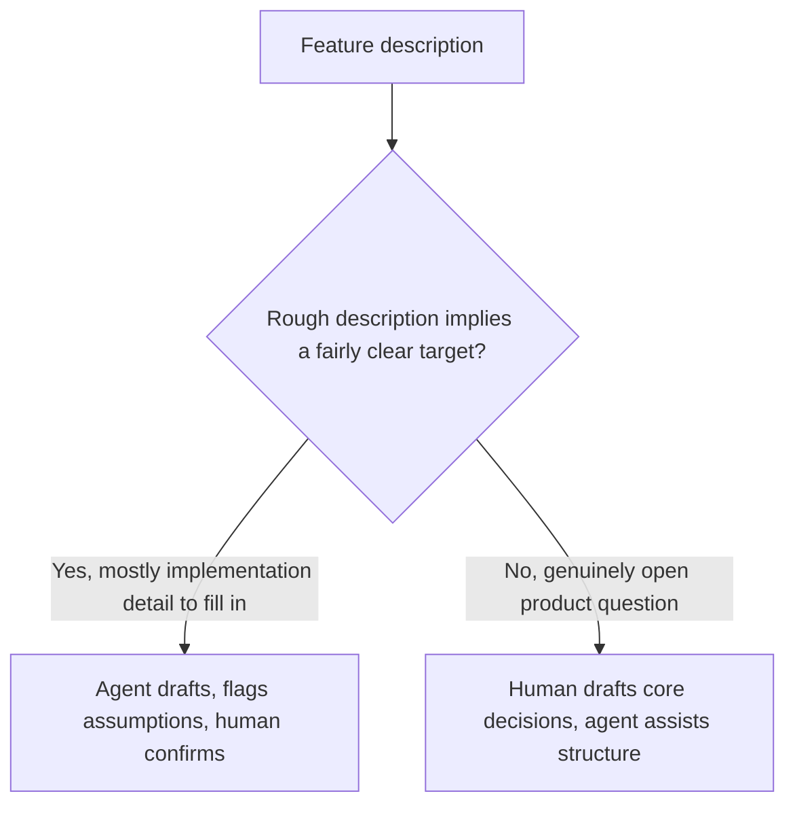

Having an agentic coding tool draft a formal spec from a rough, informal feature description is meaningfully faster than a human writing the full spec by hand — and it introduces a specific risk that doesn't exist in either fully-human or fully-agent-driven workflows: when the rough description is ambiguous or incomplete, an agent drafting the formal spec has to resolve that ambiguity *somehow* to produce a complete-looking document, and it will generally do so by filling gaps with plausible assumptions rather than leaving them visibly open.

## The Failure Mode, Concretely

A product owner writes: "Add the ability for users to export their data." An agent drafting the formal spec from that has to decide, without being asked: what format(s)? Synchronous or async for large accounts? Rate-limited? Does it include data from linked third-party integrations? A confident agent-authored spec will make a reasonable choice on each of these and present it as settled — reading as a complete, considered spec, when in fact several genuinely open product decisions got silently resolved by the agent rather than by the person who should have made them.

## Require the Agent to Flag Its Own Assumptions

```python
SPEC_DRAFT_PROMPT = """Draft a formal spec from this feature description.
For any requirement where the description doesn't specify a detail you need
to make a decision, DO NOT silently choose — instead, list it explicitly
under "Open Questions" with your suggested default and why, so a human can
confirm or override it before this spec is treated as final."""
```

```markdown
## Open Questions (agent-flagged, needs human confirmation)
1. Export format: suggesting CSV + JSON (most common formats for this use case).
   Confirm or specify otherwise.
2. Sync vs async: suggesting async with email notification for accounts over
   10k records, given likely processing time. Confirm threshold.
3. Third-party integration data: description doesn't specify. Excluding by
   default unless confirmed in scope.
```

This changes the failure mode from silent to visible — the spec review step (from earlier in this series) now has a specific, bounded list of decisions that need explicit human confirmation, rather than requiring the reviewer to independently notice every place the agent quietly filled a gap.

## When Human-First Drafting Is Still the Better Choice

For genuinely novel, high-ambiguity features — where the "rough description" is really more of an open problem than a lightly-underspecified one — a human drafting the initial spec, with the agent assisting on structure and completeness checking rather than generating the substantive content from scratch, avoids the agent making product decisions it has no real basis for making. The dividing line: if the rough description already implies a fairly clear target and the agent's job is filling in standard implementation-level detail, agent-first drafting with flagged assumptions works well; if the feature itself is still genuinely undefined, start with a human draft.



## Key Takeaways

1. **Agent-drafted specs from ambiguous descriptions risk silently resolving open decisions instead of flagging them**
2. **Explicitly require the agent to list assumptions as open questions**, not bury them as settled requirements
3. **This converts a silent risk into a bounded, reviewable list** — the spec review step now has something specific to check
4. **For genuinely open product questions, start with a human draft** — agent-first drafting fits best when the target is already fairly clear

---

*Part of the [Spec-Driven Development series](/tags/sdd-series/) — how agentic coding goes from vibe-coded prototypes to production-grade systems.*
