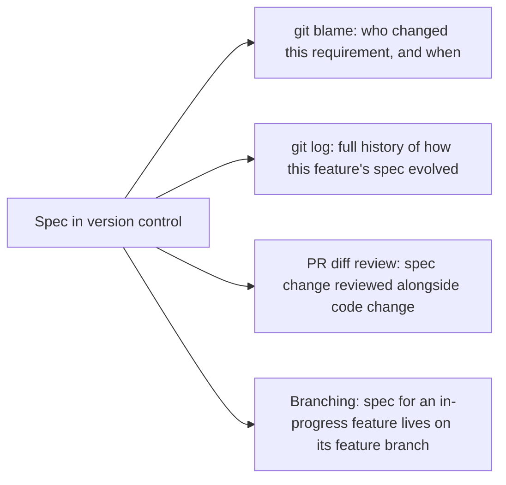

A spec stored in Confluence, Notion, or any tool separate from the codebase it describes has no structural connection to the code changes that implement or modify it — nothing forces a code change and its corresponding spec update to happen together, or even to happen anywhere near each other in time. This is the same drift risk from earlier in this series, but this post is about the specific fix: co-locating specs with code in version control removes the structural gap that lets drift happen invisibly.

## The Practical Layout

```
repo/
  specs/
    features/
      password-reset-token-expiry.md
      data-export.md
    architecture/
      constitution.md
    CHANGELOG.md
  src/
    ...
```

Specs live in the same repository, reviewed through the same pull request process, versioned with the same git history as the code they describe. A PR implementing or modifying a feature includes the spec change in the same diff — not a separate PR, not a separate tool, not a follow-up ticket to "update the docs later" that may or mayant get done.

## What This Buys You Beyond Just Colocation



`git blame` on a spec file answers "why does this requirement say what it says" the same way it answers that question for code — pointing to the specific commit and PR discussion where a decision was made, which is a much better answer than "someone probably decided this at some point, ask around."

## CI Can Enforce the Colocation Discipline

The earlier drift-detection check — flag a PR that changes behavior-relevant code without touching the corresponding spec — becomes straightforward to implement as an actual CI gate once specs are in the same repository as code, checkable via the diff itself rather than requiring cross-system integration between a code repo and a separate docs tool:

```python
def ci_check_spec_updated(pr_diff) -> bool:
    code_changes = [f for f in pr_diff.files if f.path.startswith("src/")]
    spec_changes = [f for f in pr_diff.files if f.path.startswith("specs/")]
    behavior_relevant = any(covers_behavior_change(f) for f in code_changes)
    return not behavior_relevant or len(spec_changes) > 0
```

## Migrating Existing Specs Out of a Wiki

For teams with existing specs scattered across wikis and docs tools, the migration doesn't need to happen all at once — moving specs into version control as each one comes up for its next revision is a reasonable incremental path, rather than a disruptive one-time migration project that competes with actual feature work for priority.

## Key Takeaways

1. **A spec in a separate tool from the code has no structural connection to the changes that should update it**
2. **Colocating specs with code in the same repo, reviewed in the same PRs, closes that gap directly**
3. **`git blame` and `git log` on specs answer "why does this say what it says"** the same way they do for code
4. **Colocation makes automated drift detection straightforward to implement as an actual CI gate**, not just a manual discipline

---

*Part of the [Spec-Driven Development series](/tags/sdd-series/) — how agentic coding goes from vibe-coded prototypes to production-grade systems.*
