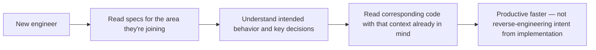

An unplanned benefit of a mature spec-driven workflow: the accumulated specs for existing features, written as specific and checkable documents rather than vague design notes, form a reasonably complete map of what the system does and why — exactly the kind of resource a new engineer usually has to reconstruct slowly from code reading and asking colleagues. Using this deliberately, rather than treating it as an incidental side effect, meaningfully speeds up onboarding.

## Reading Specs vs Reading Code, for a New Engineer

Code tells a new engineer *how* something is implemented, in exhaustive and sometimes overwhelming detail. A spec tells them *what* the system is supposed to do and *why*, at a level of abstraction that's actually digestible before they've built up enough context to read implementation details productively. Starting from specs, then reading the corresponding code once the intended behavior is understood, is a faster on-ramp than starting from code and trying to reverse-engineer intent.



## Build an Onboarding Path Through the Specs, Not Just a List

A flat directory of specs is still a lot to work through without guidance. A curated onboarding path — "read the constitution first, then these five specs covering the core domain model, in this order" — turns an unstructured pile of documents into something closer to a syllabus, and is cheap to maintain once it exists since it just points at specs that already exist for other reasons.

```markdown
## Onboarding Reading Path: Payments Team
1. `specs/architecture/constitution.md` — foundational constraints
2. `specs/architecture/payment-flow-overview.md` — core domain model
3. `specs/features/refund-processing.md` — most-touched feature, good complexity example
4. `specs/features/webhook-retry-policy.md` — illustrates our approach to reliability
```

## A New Engineer's First Task: Write a Spec

For a new engineer's first real contribution, having them write the spec for a small, well-scoped change — rather than jumping straight to code — doubles as an onboarding exercise and a genuine test of whether they've absorbed the constitution's constraints and the team's existing decisions. A spec review at that stage surfaces misunderstandings early, in a cheap document-review cycle, rather than in a more expensive code-review cycle after they've already implemented something based on a misunderstanding.

## Keep the Onboarding Path Itself Current

Like any spec, an onboarding reading path can drift — pointing at specs that have since been superseded or deprecated. Treat it as its own maintained artifact, reviewed periodically (a natural trigger: whenever it's actually used for a new hire, which surfaces staleness directly through their questions and confusion).

## Key Takeaways

1. **Well-written specs are a genuinely good onboarding resource** — they convey intent at a digestible abstraction level code doesn't
2. **Starting from specs before code gives a new engineer context that makes code reading faster and more productive**
3. **A curated reading path through existing specs is cheap to build and turns a document pile into a syllabus**
4. **Have a new engineer's first contribution be a spec, not code** — it's a cheap way to surface misunderstandings before they reach implementation

---

*Part of the [Spec-Driven Development series](/tags/sdd-series/) — how agentic coding goes from vibe-coded prototypes to production-grade systems.*
