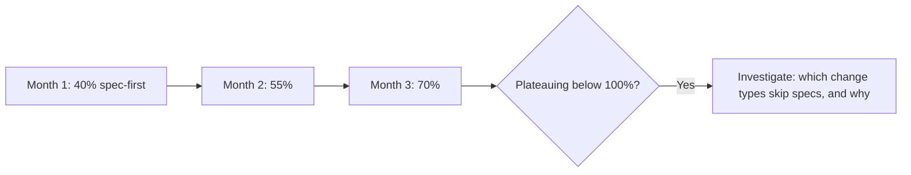

A team can adopt spec-driven development in name — the tooling is set up, the constitution exists, the process is documented — while individual engineers, under deadline pressure, quietly skip writing a real spec and go straight to implementation on a meaningful fraction of changes. Whether that's actually happening is a measurable question, not something that should rely on a vibe check at a retro.

## What to Actually Measure

```python
def compute_sdd_adoption_metrics(merged_prs: list[dict], time_window_days: int = 30) -> dict:
    recent = [pr for pr in merged_prs if pr["age_days"] < time_window_days]
    behavior_changing = [pr for pr in recent if pr["changes_behavior"]]

    return {
        "pct_with_spec_change": pct(pr["has_spec_change"] for pr in behavior_changing),
        "pct_spec_predates_implementation": pct(
            pr["spec_commit_time"] < pr["first_impl_commit_time"] for pr in behavior_changing
        ),
        "avg_spec_review_comments": avg(pr["spec_review_comment_count"] for pr in behavior_changing),
    }
```

The second metric — spec predates implementation, not just "a spec exists somewhere in the PR" — is the one that actually distinguishes real spec-driven development from a team writing the spec *after* the code as a documentation formality to satisfy a checklist. Both produce "has a spec," only one reflects the workflow actually working as intended.

## Track Trend, Not Just a Snapshot



A single measurement tells you where the team is; a trend tells you whether adoption is progressing, stalled, or regressing. If adoption plateaus below full coverage, the useful follow-up isn't a blanket reminder to "write specs" — it's investigating which specific *categories* of change are skipping the process (small bug fixes, often reasonably exempt; a specific team or engineer, worth a direct conversation; a specific project under unusual deadline pressure, a signal worth surfacing to leadership).

## Not Every Change Needs a Full Spec — Define the Threshold Explicitly

A one-line bug fix doesn't need the same spec process as a new feature, and measuring adoption without accounting for this produces a misleadingly low number that includes changes that were never supposed to go through the full process. Define, explicitly, what counts as "behavior-changing enough to require a spec" — a small, fixed rule (e.g., any change touching a public API, any change to business logic, any change affecting more than N files) works better than leaving it to individual judgment, which is exactly the kind of ambiguity that erodes adoption over time.

## The Metric Is a Diagnostic, Not a Performance Score

Reporting individual engineers' spec-adoption rates as a performance metric creates an incentive to write low-effort, checklist-satisfying specs rather than genuinely useful ones — the same Goodhart's-law risk any metric has once it becomes a target. Use this at the team level, as a diagnostic for where the process itself needs adjustment, not as an individual scorecard.

## Key Takeaways

1. **"Has a spec" and "spec written before implementation" are different metrics** — only the second reflects the workflow actually working
2. **Track trend over time**, not a single snapshot, to distinguish stalled adoption from healthy progress
3. **Define explicitly what change size requires a full spec** — measuring without that threshold conflates exempt changes with real skips
4. **Use this as a team-level diagnostic, not an individual performance score** — turning it into a target invites low-effort specs written just to satisfy the metric

---

*Part of the [Spec-Driven Development series](/tags/sdd-series/) — how agentic coding goes from vibe-coded prototypes to production-grade systems.*
