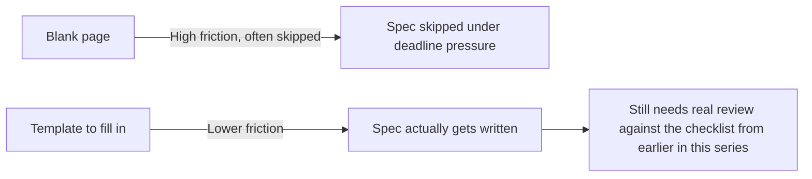

The single biggest practical obstacle to consistent spec-writing isn't disagreement about its value — it's the blank-page problem. An engineer who agrees specs are worth writing still hesitates in front of an empty document with no structure to fill in. A small library of templates, one per common change type, removes that friction directly.

## Template: New Feature

```markdown
## Feature: [Name]

### Problem
What user or business problem does this solve? Be specific about who has this problem.

### Requirements
- [Numbered, specific, checkable requirements]

### Non-Goals
- [What this explicitly does not do, to bound scope]

### Acceptance Criteria
- [ ] [Checkable condition]
- [ ] [Checkable condition]

### Open Questions
- [Anything requiring a decision before implementation]
```

## Template: Bug Fix (for anything beyond a trivial one-liner)

```markdown
## Bug Fix: [Name]

### Current (Incorrect) Behavior
[Specific, reproducible description]

### Expected Behavior
[What should happen instead]

### Root Cause
[If known — helps prevent recurrence]

### Regression Test
- [ ] Test case added covering this specific bug
```

## Template: API Change

```markdown
## API Change: [Endpoint/Method]

### Current Contract
[Existing request/response shape, if modifying]

### New Contract
[New request/response shape]

### Backward Compatibility
- [ ] Breaking change? If yes, migration path for existing consumers:
- [ ] Versioning approach:

### Acceptance Criteria
- [ ] [Checkable condition]
```

## Template: Migration (Referencing the Earlier Post's Structure)

```markdown
## Migration: [System/Component]

### Current Behavior Spec
[Link to or inline documentation of actual current behavior]

### Target Behavior Spec
[Description of the destination state]

### Migration Stages
1. [Stage, with rollback point and success criteria]
2. [Stage, with rollback point and success criteria]
```

## Templates Reduce Friction; They Don't Replace Judgment



A filled-in template is a starting point for review, not a substitute for it — the spec review checklist from earlier in this series still applies fully to a template-based spec. What the template buys is a higher likelihood the spec gets written at all, not a guarantee it's a good one once written.

## Let the Templates Evolve

Keep templates in the same `specs/` directory as the specs themselves, and treat them as living documents — if a recurring gap keeps showing up in spec reviews (a section nobody thinks to fill in, a category of requirement that's easy to forget), update the template to prompt for it explicitly, rather than relying on reviewers to keep catching the same gap indefinitely.

## Key Takeaways

1. **The blank-page problem is the biggest practical friction point in getting specs written at all**
2. **Templates per common change type (feature, bug fix, API change, migration) remove that friction directly**
3. **A template lowers the barrier to writing a spec — it doesn't lower the bar for what counts as a good one**, review still applies fully
4. **Evolve templates based on recurring gaps found in spec reviews**, rather than relying on reviewers to keep catching the same thing repeatedly

---

*Part of the [Spec-Driven Development series](/tags/sdd-series/) — how agentic coding goes from vibe-coded prototypes to production-grade systems.*
