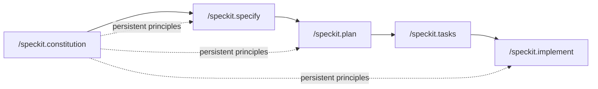

The [last post](/posts/vibe-coding-vs-spec-driven-development/) made the case for spec-driven development in the abstract. This one is the hands-on guide to the first concrete tool: **GitHub's Spec-Kit**, an open-source toolkit that layers a structured spec-driven workflow onto whatever coding agent you're already using — GitHub Copilot, Claude Code, Gemini CLI, or others.

## Installing and Initializing

Spec-Kit ships as a CLI called `specify`, installed and run directly via `uvx` without a separate install step:

```bash
uvx --from git+https://github.com/github/spec-kit.git specify init my-project
cd my-project
```

`specify init` scaffolds a `.specify/` directory into your project — templates, helper scripts, and a memory folder that holds the one document every subsequent step reads from.

## The Workflow: Constitution → Specify → Plan → Tasks → Implement



Each phase is a slash command you run inside your coding agent's chat, and each one produces a markdown artifact the next phase consumes. Nothing here is a black box — every intermediate output is a file you can open, edit by hand, and review before moving to the next step.

### `/speckit.constitution` — Run This First, Once

The constitution establishes the non-negotiable principles for the entire project — the standards no feature spec is allowed to violate. It's stored at `.specify/memory/constitution.md` and every later phase reads it:

```markdown
# Project Constitution

## Testing
- Every feature must ship with tests covering its acceptance criteria before /speckit.implement is considered complete.
- No PR merges with failing tests, regardless of feature deadline pressure.

## Architecture
- All external API calls go through the `services/` layer — no direct HTTP calls from route handlers.
- Database migrations are additive-only in production; no destructive schema changes without an explicit approval step.

## Security
- User input is validated at the API boundary, never trusted downstream.
- No secrets in code or commit history — environment variables only.
```

This is the artifact that solves the "context doesn't persist across sessions" problem from the [previous post](/posts/vibe-coding-vs-spec-driven-development/) — a brand-new agent session, or even a different coding tool entirely, reads the same constitution and inherits the same constraints instead of re-deriving (or forgetting) them.

### `/speckit.specify` — The What and Why

Describe the feature in plain language. This command produces `spec.md` — deliberately focused on *what* the feature does and *why*, not *how* it's implemented:

```markdown
# Feature: Password Reset

## Why
Users who forget their password currently have to contact support manually,
which doesn't scale past a handful of requests per day.

## What
Users can request a password reset via email. The reset link expires after
15 minutes and can only be used once.

## Acceptance Scenarios
- Given a valid registered email, requesting a reset sends a reset link within 30 seconds.
- Given an expired reset link, attempting to use it shows an "expired" error, not a silent failure.
- Given a reset link that's already been used, a second attempt is rejected.
```

### `/speckit.plan` — The Technical Approach

Given the spec, `/speckit.plan` establishes the technical approach — stack choices, data model changes, which existing services get touched — producing `plan.md`. This is where the constitution's constraints actually bind: if the constitution says all external calls go through `services/`, the plan for a feature that sends email has to route through that layer, not invent a shortcut.

### `/speckit.tasks` — Breaking It Down

`/speckit.tasks` turns the plan into `tasks.md` — a checklist of concrete, individually completable units of work, each one traceable back to a specific acceptance scenario in the spec:

```markdown
# Tasks: Password Reset

- [ ] T1: Add `reset_tokens` table (token, user_id, expires_at, used_at)
- [ ] T2: Add `POST /auth/reset-request` endpoint — validates email, generates token, sends email via services/email.py
- [ ] T3: Add `POST /auth/reset-confirm` endpoint — validates token not expired/used, updates password, marks token used
- [ ] T4: Tests for expired-token and already-used-token rejection (spec acceptance scenarios 2 and 3)
```

### `/speckit.implement` — Execution

Finally, `/speckit.implement` executes the task list, generating code that traces back through tasks → plan → spec → constitution at every step. If the agent's implementation of T2 tries to call an email API directly instead of going through `services/email.py`, that's a constitution violation it should be catching itself against, not something a human has to notice in review after the fact.

## Directory Structure After a Few Features

```
.specify/
  memory/constitution.md
  scripts/
  templates/
specs/
  001-password-reset/
    spec.md
    plan.md
    tasks.md
  002-two-factor-auth/
    spec.md
    plan.md
    tasks.md
```

Every feature gets its own numbered spec directory — a durable, greppable history of what was built and why, sitting right next to the code it produced, instead of buried in a chat transcript nobody can search six months later.

## Practices That Make This Work

**Keep the constitution short and genuinely non-negotiable.** It's tempting to dump every style preference into it, but a bloated constitution dilutes the things that actually matter. Reserve it for constraints you'd block a PR over.

**Review `spec.md` before running `/speckit.plan`.** The spec is cheap to change; the plan and tasks that follow it are not. Catching a wrong assumption at the spec stage costs a paragraph edit — catching it after `/speckit.implement` has generated code costs a rewrite.

**Re-run `/speckit.tasks` instead of hand-editing `tasks.md` when requirements change.** Hand-editing breaks the traceability between tasks and the spec that produced them — the whole point of the chain is that every file downstream is regenerable from the one upstream of it.

## Key Takeaways

1. **The constitution is the persistent memory an agent session doesn't otherwise have** — it's what makes a new session or a different agent tool pick up the same standards automatically
2. **Each phase produces a reviewable markdown artifact**, not a black-box transformation — you can and should read spec.md before letting plan.md get generated from it
3. **Tasks trace back to acceptance scenarios**, which is what makes "done" mean something more specific than "looks right"
4. **It's agent-agnostic by design** — the same `.specify/` artifacts work whether you're driving Claude Code, Copilot, or Gemini CLI
5. **Treat generated files as regenerable, not hand-edited** — change the spec, then re-run the phases after it, rather than patching downstream files directly

Next up: [Kiro](/posts/kiro-ide-specs-steering-hooks/) takes a structurally different approach to the same problem — instead of layering onto your existing agent, it builds an entire IDE around the spec-driven workflow.

---

*Part of the [Spec-Driven Development series](/tags/sdd-series/) — how agentic coding goes from vibe-coded prototypes to production-grade systems.*
