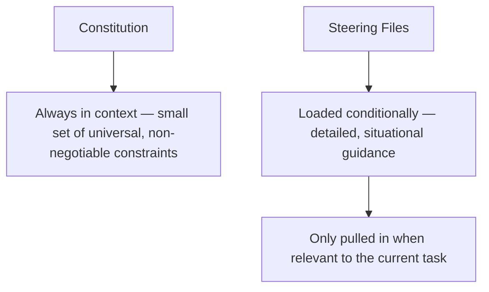

The earlier post on writing a constitution doc argued for keeping it short enough to reliably stay prominent in context — which raises an obvious question: where does the situational, detailed guidance go that a real codebase accumulates over time (how to structure a new React component in this specific codebase's conventions, what the team's specific approach to error handling looks like in this specific service)? In Kiro, that's what steering files are for.

## Steering Files vs the Constitution



The constitution is unconditional — every session sees it, regardless of task. Steering files are conditional — Kiro loads the ones relevant to the current task's context (file patterns being touched, task type) rather than loading every steering file into every session, which would recreate the same context-bloat problem the constitution's brevity was meant to avoid.

## Structuring Steering Files by Scope

```
.kiro/steering/
  frontend-conventions.md      # loaded when touching src/frontend/**
  api-design-standards.md      # loaded when touching src/api/**
  testing-approach.md          # loaded for any task involving test files
  database-migration-rules.md  # loaded when touching migrations/**
```

Each file's front matter typically declares its own loading condition — a glob pattern or task-type match — so the steering system knows when to pull it in without a human manually deciding relevance for every session:

```yaml
---
applies_to: "src/api/**"
---
# API Design Standards
- All endpoints return errors in the shape: {"error": {"code": str, "message": str}}
- Pagination uses cursor-based, not offset-based, for any list endpoint
- ...
```

## Why This Split Matters for Agentic Coding Specifically

A single monolithic guidance document mixing universal constraints with situational detail forces every session to either load the whole thing (defeating the point of keeping the constitution lean) or rely on the model to correctly judge which parts are relevant to the current task (an unreliable filter, since the model doesn't know what it doesn't know about the rest of the document). Explicit, declared loading conditions remove that judgment call from the model entirely — the steering system decides what's relevant based on the task's actual file scope, not the model's guess.

## Keep Steering Files as Narrow as Their Scope Suggests

The temptation with steering files is to let them grow broad, covering more than their stated scope, once they exist as a place to put "guidance." This defeats their purpose — a `frontend-conventions.md` file that's crept to include backend guidance gets loaded for frontend tasks that don't need that content, quietly reintroducing the context bloat the whole system was designed to avoid. Keep each file's actual content matched to its declared scope.

## Key Takeaways

1. **Steering files hold situational, detailed guidance that a lean constitution deliberately excludes**
2. **They're loaded conditionally, based on declared scope**, not unconditionally like the constitution
3. **Explicit loading conditions remove relevance-judgment from the model**, which is an unreliable filter for "does this apply to my current task"
4. **Keep each steering file's content matched to its declared scope** — scope creep within a file reintroduces the context bloat this system exists to prevent

---

*Part of the [Spec-Driven Development series](/tags/sdd-series/) — how agentic coding goes from vibe-coded prototypes to production-grade systems.*
