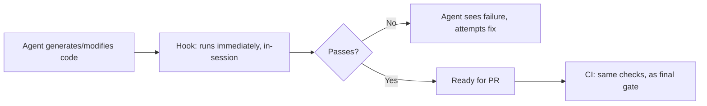

A spec, however well-written, describes intended behavior — it doesn't by itself guarantee an agent's generated code passes lint rules, type checks, or the existing test suite before a human reviewer sees it. Hooks — automated checks that run at defined points in the agentic coding workflow, not just in CI after a PR is opened — close that gap earlier, catching mechanical issues before they ever reach human review.

## Where Hooks Fit, Relative to CI



CI is the backstop that runs regardless of what happened in the session — necessary, but by the time it runs, a human may have already looked at a PR with lint errors or failing tests. Hooks run *during* the agentic coding session itself, immediately after a change, giving the agent the chance to see and fix the failure before the human ever needs to look at it.

## A Practical Hook Configuration

```yaml
# .kiro/hooks/on-file-save.yaml
triggers:
  - pattern: "src/**/*.py"
    run:
      - "ruff check {file}"
      - "mypy {file}"
  - pattern: "src/**/*.test.py"
    run:
      - "pytest {file} -x"
```

```python
def hook_result_to_agent_feedback(hook_output: dict) -> str:
    if hook_output["passed"]:
        return "All checks passed."
    return f"""The following checks failed after your last change:
{hook_output['failures']}
Please fix these before continuing."""
```

Feeding the hook's failure output back to the agent as an immediate correction prompt, rather than just logging it for a human to notice later, is what makes this genuinely faster than the CI-only alternative — the agent self-corrects within the same session, often within seconds, instead of a human catching it in review and sending it back.

## Choosing What Belongs in a Hook vs What Stays in CI Only

Fast, deterministic checks (linting, type checking, unit tests for the specific files touched) fit well as hooks — they run quickly enough not to disrupt the agentic coding flow. Slow checks (a full integration test suite, a full build) belong in CI only; running them on every file save would make the session feel sluggish and would be run far more often than necessary, since most individual file saves don't need full-suite verification.

## Hooks Reduce, Not Replace, Human Review Scope

A PR that's already passed every hook-enforced check during development arrives at human review free of the mechanical issues (lint violations, type errors, obviously broken tests) that would otherwise consume review attention — letting the human reviewer focus entirely on the things hooks structurally can't check: whether the implementation actually matches the spec's intent, whether the approach is architecturally sound, whether the spec itself was right in the first place.

## Key Takeaways

1. **Hooks run during the agentic session, catching mechanical issues before a human ever sees them** — CI is the backstop, not the first line
2. **Feed hook failures back to the agent as an immediate correction prompt**, not just a log entry for later
3. **Fast, deterministic checks fit as hooks; slow checks stay CI-only** to avoid disrupting the coding flow
4. **Hooks free human review to focus on intent and architecture**, not mechanical issues that should never have reached review in the first place

---

*Part of the [Spec-Driven Development series](/tags/sdd-series/) — how agentic coding goes from vibe-coded prototypes to production-grade systems.*
