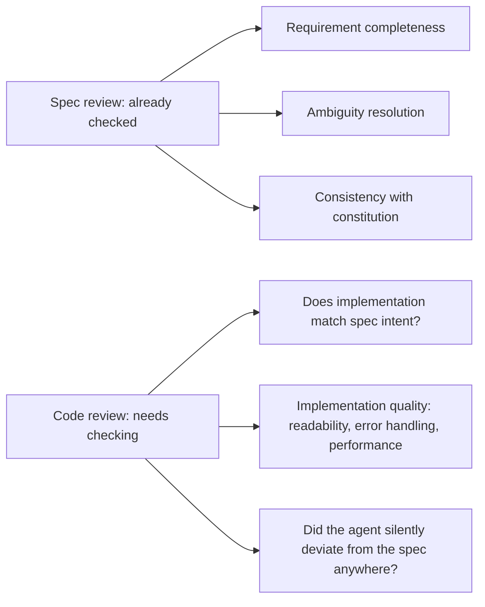

Reviewing a PR that implements an already-reviewed spec is a different task than reviewing code with no spec behind it, and treating it identically wastes reviewer attention on things the spec review already covered, while potentially under-checking the things unique to this stage — whether the implementation actually matches what the spec specified.

## The Focus Shift



Requirement completeness and ambiguity were the spec review's job, done before implementation started. Re-litigating them at code review is redundant if the spec review was done properly — the code reviewer's actual job is verifying the implementation matches what was already agreed, plus the implementation-quality concerns that only exist once code exists.

## Checking Implementation-Spec Fidelity Directly

```python
def spec_fidelity_checklist(spec_path: str, pr_diff) -> list[str]:
    """Not a fully automatable check — a structured prompt for the reviewer."""
    return [
        f"Does the diff implement every acceptance criterion in {spec_path}?",
        "Does the diff implement anything NOT specified — undocumented scope creep?",
        "Where the spec was ambiguous (flagged as an open question), was it resolved as agreed, or did the agent choose differently?",
        "Are there deviations from the spec that seem reasonable but weren't explicitly approved?",
    ]
```

The third and fourth items are the ones most likely to slip through in a review that only checks "does this look like reasonable code" — an agent implementing a spec sometimes makes a small, sensible-seeming deviation (a slightly different error message, a different default value) that technically diverges from what was specified and reviewed. Individually minor, and worth catching because unreviewed deviations are exactly how spec-driven development's guarantees quietly erode.

## Scope Creep Is Easy to Miss in an Agent-Generated Diff

An agent implementing a feature will sometimes also fix an unrelated small issue it noticed along the way, or add a small enhancement beyond what was asked — often genuinely helpful, and also unreviewed scope that wasn't part of the approved spec. Flag this explicitly rather than let it pass because the addition itself looks reasonable; the process value of spec-driven development depends on what actually ships matching what was actually reviewed.

## Reviewer Time Should Shift Toward Judgment, Not Mechanics

Combined with the hooks from the previous post handling mechanical checks automatically, a spec-driven code review should spend most of its time on the things that require human judgment — does this implementation actually serve the spec's intent, is the approach sound — rather than on lint violations or test failures that should never have reached review in the first place.

## Key Takeaways

1. **A spec-driven code review has a different focus than a review with no spec behind it** — don't re-litigate what spec review already covered
2. **Check implementation-spec fidelity directly and explicitly**, including whether ambiguous points were resolved as agreed
3. **Watch for unreviewed scope creep in agent-generated diffs** — small "while I was in there" additions that weren't part of the approved spec
4. **Combined with hooks handling mechanics, code review time should concentrate on judgment calls that require a human**

---

*Part of the [Spec-Driven Development series](/tags/sdd-series/) — how agentic coding goes from vibe-coded prototypes to production-grade systems.*
