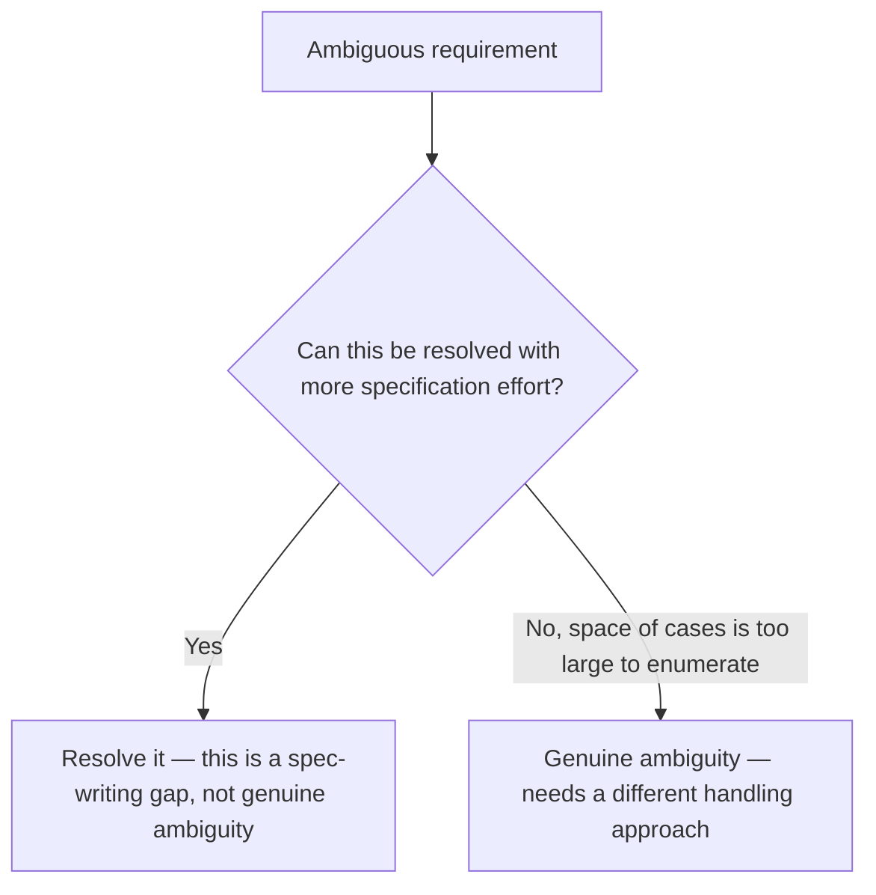

The spec review checklist earlier in this series treats ambiguity as something to eliminate before implementation. Most ambiguity should be eliminated that way. Some genuinely can't be — a requirement like "handle malformed input gracefully" covers a space of possible malformed inputs too large to enumerate exhaustively in advance, and no amount of spec-writing effort produces a document that anticipates every case before it's actually encountered.

## Distinguishing Eliminable From Irreducible Ambiguity



The test for which category a given ambiguity falls into: would a reasonable amount of additional spec-writing effort actually resolve it, or does resolving it require encountering the specific case first? "What format should the export be" is eliminable — someone can just decide. "How should the system behave on inputs we haven't anticipated" is closer to irreducible — the space is open-ended by nature.

## Specifying a Decision Procedure Instead of an Outcome

For genuinely irreducible ambiguity, the spec's job shifts from stating the correct outcome (impossible to know in advance) to stating the correct *process* for handling the unanticipated case when it arrives:

```markdown
## Requirement: Malformed input handling
Rather than enumerating every malformed-input case, this system follows a
decision procedure when input doesn't match expected format:
1. Log the specific malformation with enough detail to reproduce it
2. Return a generic "invalid input" error to the caller — never expose
   internal parsing details in the error message
3. Do NOT attempt to guess the caller's intent and proceed with a
   best-effort interpretation
4. Flag for spec update if this malformation pattern recurs more than
   3 times in a week — it likely warrants explicit handling
```

This is a genuinely different kind of requirement than "when X happens, do Y" — it's "when something outside what we specified happens, follow this process," which is checkable and enforceable even though it doesn't predict every specific outcome.

## The Feedback Loop Back Into the Spec

Point 4 in that example matters — a decision procedure for handling the unanticipated isn't meant to be the permanent answer for a recurring case. Once a specific "unanticipated" case shows up often enough to be worth explicit handling, it graduates from "handled by the general decision procedure" to "its own explicit requirement," and the spec should be updated accordingly. This is how irreducible ambiguity gets reduced over time, incrementally, driven by actual observed cases rather than upfront speculation.

## Don't Let "It's Genuinely Ambiguous" Become an Excuse

The risk in naming this category explicitly is that it becomes a convenient escape hatch for ambiguity that was actually eliminable with more effort. Apply the test above rigorously — most ambiguity encountered in practice is eliminable, and reaching for "this is just genuinely ambiguous" without first attempting resolution defeats the purpose of having spec review at all.

## Key Takeaways

1. **Most ambiguity is eliminable with more spec-writing effort — but not all of it, and conflating the two is a mistake in both directions**
2. **For irreducible ambiguity, specify a decision procedure, not a predicted outcome** — this is still checkable and enforceable**
3. **Build in a feedback loop**: a recurring "unanticipated" case should graduate into its own explicit requirement over time
4. **Apply a real test before calling something irreducibly ambiguous** — it's an easy excuse for ambiguity that was actually just under-specified

---

*Part of the [Spec-Driven Development series](/tags/sdd-series/) — how agentic coding goes from vibe-coded prototypes to production-grade systems.*
