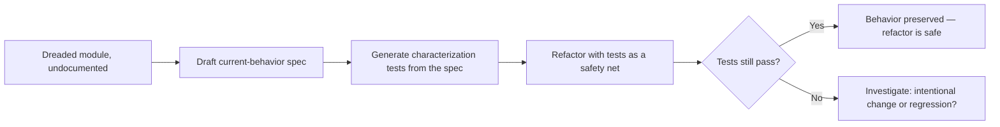

Every codebase has at least one module everyone avoids touching — old, load-bearing, with behavior nobody fully understands anymore and no documentation describing what it's actually supposed to do. The fear isn't irrational: without a spec, "did this refactor preserve behavior" is unanswerable except by hoping the existing test coverage (often thin, for exactly this kind of code) catches any regression.

## Write the Behavior Spec Before Touching Anything

This is a direct application of the current-behavior-spec approach from the legacy migration post earlier in this series, scoped to a single scary module rather than a full system migration: before refactoring, produce a spec documenting what the code *actually does*, not what a refactor should make it do.

```python
def draft_current_behavior_from_dreaded_module(module_path: str) -> str:
    prompt = """Analyze this code and document its complete observable behavior:
    inputs, outputs, side effects, error conditions, and any behavior that
    looks unintentional but might be depended on. Do not editorialize about
    whether the behavior is 'correct' — just document what it does."""
    return llm.invoke(prompt, context=read_module(module_path))
```

The output of this step is the safety net for the refactor — a concrete, checkable description of current behavior that the refactored version needs to match, turning "did I break anything" from a hope into a verifiable question.

## Generate Characterization Tests From the Behavior Spec

Once current behavior is documented, generate tests asserting that exact behavior — even parts that look wrong or unintentional. These are characterization tests, not correctness tests: their job is proving the refactor didn't change behavior, not proving the behavior is right.



## Separate "Preserve Behavior" From "Fix Behavior"

A refactor of dreaded code often surfaces behavior that looks like a bug — and the temptation is to fix it in the same pass, since you're already in there. Resist this: a refactor that changes structure *and* fixes suspected bugs simultaneously makes it much harder to isolate which change caused which effect if something goes wrong. Do the structural refactor first, verified against the characterization tests, then propose behavior fixes as separate, explicitly-reviewed follow-up changes — each with its own small spec describing exactly what's changing and why.

## This Makes the Scary Module Progressively Less Scary

Once a behavior spec exists and characterization tests pass, the module stops being an unknown black box — it has documentation, even if that documentation was reconstructed rather than originally written, and it has a test suite that will catch a future regression. The next engineer who has to touch this code inherits a meaningfully safer starting point than the one before the refactor began.

## Key Takeaways

1. **The scariest code to refactor is exactly the code with no spec** — write the current-behavior spec first, before touching anything
2. **Generate characterization tests from that spec** — their job is proving behavior preservation, not correctness
3. **Separate structural refactoring from behavior fixes** — doing both simultaneously makes it hard to isolate what caused what if something breaks
4. **This process leaves the module permanently less scary** for the next engineer, not just safely refactored once

---

*Part of the [Spec-Driven Development series](/tags/sdd-series/) — how agentic coding goes from vibe-coded prototypes to production-grade systems.*
