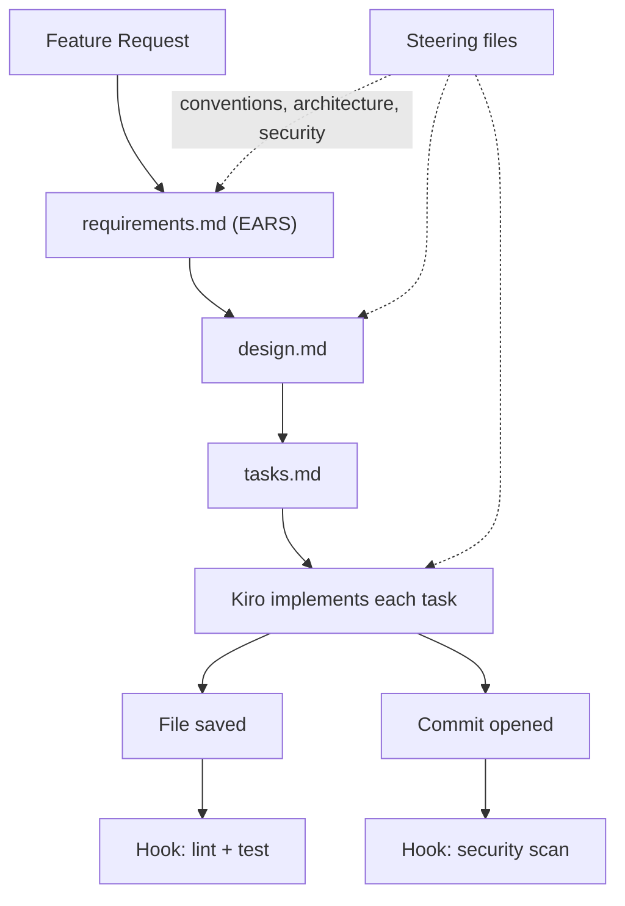

[Spec-Kit](/posts/github-spec-kit-practical-guide/) is something you layer onto whichever coding agent you've already chosen. **Kiro**, AWS's agentic IDE, takes the opposite approach — spec-driven development isn't an add-on, it's the default workflow the entire product is organized around, down to the notation it uses for writing requirements.

## Specs: requirements.md, design.md, tasks.md

Describe a feature to Kiro, and it generates three files under `.kiro/specs/<feature-name>/`:

```
.kiro/
  specs/
    rate-limiting/
      requirements.md
      design.md
      tasks.md
  steering/
    conventions.md
    architecture.md
  hooks/
    on-save-lint.json
    on-commit-security-scan.json
```

You review and refine each one before moving to the next — add an edge case to `requirements.md`, adjust a component boundary in `design.md` — and Kiro implements the task list against whatever you've settled on, following the project's steering files for conventions along the way.

## EARS Notation: Requirements Without Ambiguity

The detail that sets Kiro apart is `requirements.md`'s format. Rather than free-form prose, Kiro defaults to **EARS** (Easy Approach to Requirements Syntax) — a constrained requirements notation developed at Rolls-Royce in 2009 to specify airworthiness requirements for jet engine control systems. Kiro is the first commercial IDE to adopt it for everyday software development.

EARS constrains a requirement to one of five templates, built around a small, consistent keyword vocabulary:

```markdown
# Requirements: Rate Limiting

## Requirement 1
WHEN a client exceeds 100 requests per minute THE SYSTEM SHALL reject
subsequent requests with a 429 status code until the window resets.

## Requirement 2
IF a request includes a valid API key with an elevated tier THEN THE SYSTEM
SHALL apply the tier's higher rate limit instead of the default.

## Requirement 3
WHILE a client is within their rate limit THE SYSTEM SHALL NOT add any
additional latency to request processing.

## Requirement 4
WHERE the rate limiter's backing store is unavailable THE SYSTEM SHALL
fail open and allow requests through, logging the degraded state.
```

The reason this matters more for agentic coding than it might for a human-only team: ambiguous natural-language requirements are exactly where an LLM's interpretation can diverge from what you meant, silently. "The system should handle rate limiting reasonably" leaves room for an agent to invent an interpretation. "WHEN a client exceeds 100 requests per minute THE SYSTEM SHALL reject subsequent requests with a 429" doesn't.

## design.md and tasks.md

`design.md` translates the EARS requirements into a technical design — which component owns the rate-limit counter, how the elevated-tier lookup works, what happens on the fail-open path from Requirement 4. `tasks.md` breaks that design into an implementation checklist, with each task referencing the requirement ID it satisfies — the same traceability principle Spec-Kit's `tasks.md` uses, just generated by Kiro directly inside the IDE rather than via a slash command.

## Steering Files: Persistent Context, Read Every Time

Where Spec-Kit centralizes persistent context into a single `constitution.md`, Kiro splits it into **steering files** — markdown documents under `.kiro/steering/` that Kiro reads on every interaction, not just once at project setup:

```markdown
# .kiro/steering/architecture.md

## Service Boundaries
- Rate limiting logic lives in `middleware/rate_limit.py` — never inline it in route handlers.
- The rate limit store is Redis. Do not introduce a second caching layer for this.

## Error Handling
- All 4xx responses include a `retry_after` field when applicable.
- Never swallow exceptions silently — log with enough context to reproduce.
```

Splitting steering across multiple focused files (conventions, architecture, security) rather than one document makes it easier to keep each one narrowly scoped and to update just the piece that's changed, without touching an unrelated section of a single monolithic file.

## Hooks: Automation That Fires on Its Own

The feature with no real equivalent in Spec-Kit is **hooks** — event-driven automations that fire on workspace events like a file save or a new commit, running in the background without you invoking anything:

```json
{
  "name": "on-save-lint-and-test",
  "trigger": { "event": "file.save", "pattern": "**/*.py" },
  "actions": [
    { "run": "ruff check --fix ${file}" },
    { "run": "pytest tests/ -k ${related_test_module}" }
  ]
}
```

```json
{
  "name": "on-commit-security-scan",
  "trigger": { "event": "commit.opened" },
  "actions": [
    { "run": "bandit -r ." },
    { "run": "detect-secrets scan" }
  ]
}
```

Hooks live as JSON files in `.kiro/hooks/` and are version-controlled with the rest of the project, so the whole team — and every agent session — shares the same automation rather than relying on each developer to remember to run the linter manually.

## The Full Loop



## Key Takeaways

1. **EARS notation removes the ambiguity that free-form requirements leave** — a bigger deal for agentic coding than for human-only teams, since ambiguous English is exactly where an agent's interpretation can quietly diverge from intent
2. **Steering files split persistent context across focused documents** rather than one monolithic file, read fresh on every interaction
3. **Hooks add automated enforcement that Spec-Kit doesn't have natively** — linting, testing, and security scanning fire on save and commit without anyone invoking them
4. **Traceability runs through every layer** — requirement ID to design decision to task to implementation
5. **Kiro trades portability for integration** — you get automation and enforcement built into the tool, at the cost of adopting Kiro as your IDE rather than layering onto whatever you already use

The next post puts these two approaches side by side and works through when each one actually makes sense for a given team.

---

*Part of the [Spec-Driven Development series](/tags/sdd-series/) — how agentic coding goes from vibe-coded prototypes to production-grade systems.*
