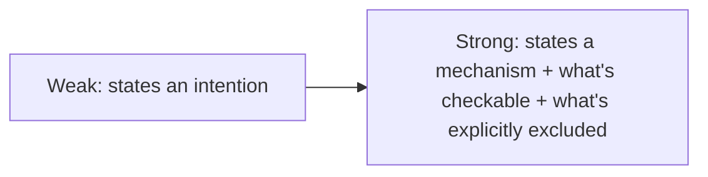

The earlier post on writing a constitution doc argued for specific, checkable constraints over aspirational language. That advice is easier to apply with concrete before-and-after examples than as abstract guidance, so this is a working session through three real categories of constitution content, annotated.

## Example 1: Technology Constraints

```markdown
## Weak
- Use appropriate technologies for the task

## Strong
- Backend: Python 3.12+, FastAPI. No Flask, no Django — already migrated away from both.
- Database: PostgreSQL via SQLAlchemy. No raw SQL in application code except in
  `migrations/` — use the ORM or a documented exception with rationale.
- No new dependency without a comment in the PR explaining why an existing
  dependency in `pyproject.toml` doesn't already cover the need.
```

*Annotation*: the strong version doesn't just name the stack — it names what was *rejected* and why ("already migrated away from both"), which prevents an agent from reasonably suggesting Flask because it's a common, sensible choice in isolation. The dependency rule is checkable by a reviewer or a CI check scanning for new entries in the dependency file.

## Example 2: Error Handling Philosophy

```markdown
## Weak
- Handle errors gracefully

## Strong
- User-facing errors never expose internal exception messages, stack traces,
  or implementation details. Use the error catalog in `errors/catalog.py`.
- Any new error condition gets a new entry in the catalog, not an ad-hoc
  message string at the call site.
- Retriable errors (network, rate limit) get automatic retry with backoff.
  Non-retriable errors (validation, auth) fail immediately — no blind
  retry-everything logic.
```

*Annotation*: "handle errors gracefully" gives an agent zero concrete guidance on what "graceful" means in this specific codebase. The strong version defines a mechanism (the error catalog) an agent can actually use consistently, and draws the retriable/non-retriable line explicitly rather than leaving it to per-case judgment.

## Example 3: Testing Requirements

```markdown
## Weak
- Write tests for new code

## Strong
- New business logic requires unit tests with >80% branch coverage on the
  new code (not the whole file).
- New API endpoints require at least one integration test hitting the
  actual route, not just the underlying function.
- Bug fixes require a regression test reproducing the original bug,
  added before the fix, confirmed failing, then passing after the fix.
```

*Annotation*: coverage percentage is checkable by tooling; "integration test hitting the actual route" vs. "unit test of the underlying function" distinguishes two things that are easy to conflate but test different failure surfaces; the regression-test sequencing (failing first, then passing) is a specific, verifiable process, not just an outcome.

## The Pattern Across All Three



Every strong version does three things the weak version doesn't: names a concrete mechanism to follow, states what's explicitly out (not just what's in), and is checkable by either a human reviewer or, in several cases, actual tooling.

## Key Takeaways

1. **Naming what was rejected, not just what's chosen, prevents an agent from reasonably re-suggesting a rejected option**
2. **Define concrete mechanisms (an error catalog, a coverage threshold) an agent can actually follow consistently**
3. **State process, not just outcome, where the process itself matters** (regression tests failing-then-passing, not just "add a test")
4. **Every strong constraint should be checkable by a human or, ideally, by tooling** — that's what separates enforceable from aspirational

---

*Part of the [Spec-Driven Development series](/tags/sdd-series/) — how agentic coding goes from vibe-coded prototypes to production-grade systems.*
