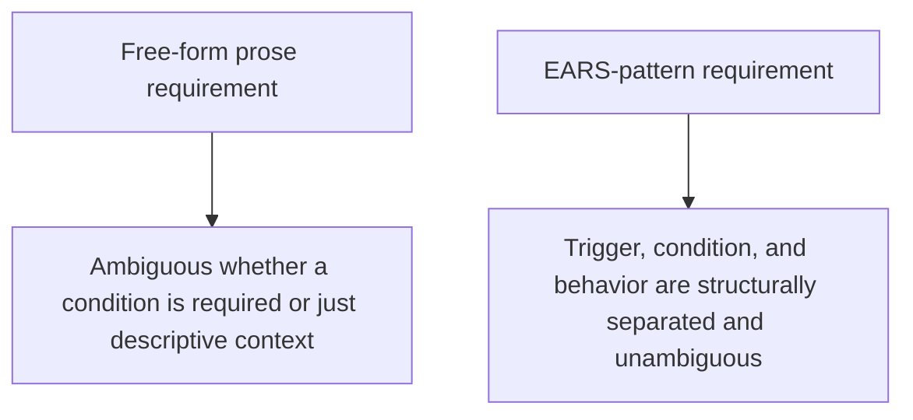

Kiro's requirements notation, derived from EARS (Easy Approach to Requirements Syntax, originally from aerospace and safety-critical systems engineering), structures every requirement as a specific sentence pattern rather than free-form prose. Coming from a background of writing specs as narrative paragraphs, the structure looks rigid at first — the rigidity is the actual point, and it's worth understanding why aerospace engineering settled on this pattern before dismissing it as unnecessary formality for software.

## The Core Pattern

```
WHEN <trigger condition>
THE SYSTEM SHALL <required behavior>
```

With variants for different requirement types:

```
# Event-driven
WHEN a user submits a password reset request
THE SYSTEM SHALL send a reset link valid for 15 minutes

# State-driven
WHILE a reset token is unexpired and unused
THE SYSTEM SHALL accept it as valid for one password reset

# Unwanted behavior
IF a reset token is expired or already used
THEN THE SYSTEM SHALL reject it with a 410 status and a specific message

# Optional feature
WHERE multi-factor authentication is enabled for the account
THE SYSTEM SHALL require a second factor before completing the reset
```

## Why the Rigidity Buys Something



Free-form prose can bury a trigger condition inside descriptive context in a way that's genuinely ambiguous whether it's a hard requirement or incidental color — "when users reset their password, which usually happens after they've forgotten it, the system sends a link" mixes a real requirement with narrative flavor in a way that's easy to misread. The EARS pattern forces every requirement into a form where the trigger, the condition, and the required behavior are each in their own structural slot — there's no ambiguity about what's the actual requirement versus what's context.

## This Maps Directly to Test Cases

Each EARS-pattern requirement maps almost mechanically to a test case, continuing the spec-driven testing theme from earlier in this series — the trigger becomes the test setup, the required behavior becomes the assertion:

```python
def test_reset_token_expiry():
    # WHEN a reset token is unexpired and unused (state-driven pattern)
    token = issue_reset_token(user)
    # THE SYSTEM SHALL accept it as valid
    assert reset_password(token, "new_pw").status_code == 200

def test_reset_token_rejection():
    # IF a reset token is expired (unwanted behavior pattern)
    token = issue_reset_token(user, issued_at=expired_time())
    # THEN THE SYSTEM SHALL reject it with 410
    assert reset_password(token, "new_pw").status_code == 410
```

## When the Formality Is Worth It, and When It's Overkill

For safety-critical or high-stakes requirements — the kind aerospace engineering built this notation for — the formality earns its cost through unambiguous traceability from requirement to test to implementation. For a low-stakes internal tool, the overhead of strict EARS notation on every requirement may exceed its value; a lighter-weight structured format (the templates from earlier in this series) can capture most of the same benefit with less formality. Match the rigor to the stakes, the same principle as the production-readiness checklist earlier in this blog.

## Key Takeaways

1. **EARS notation structurally separates trigger, condition, and required behavior**, removing the ambiguity free-form prose allows
2. **This traces back to aerospace/safety-critical engineering**, where unambiguous requirements are worth real formality overhead
3. **Each EARS-pattern requirement maps nearly mechanically to a test case** — trigger becomes setup, required behavior becomes assertion
4. **Match the notation's formality to the requirement's stakes** — not every spec needs full EARS rigor to get most of its benefit

---

*Part of the [Spec-Driven Development series](/tags/sdd-series/) — how agentic coding goes from vibe-coded prototypes to production-grade systems.*
