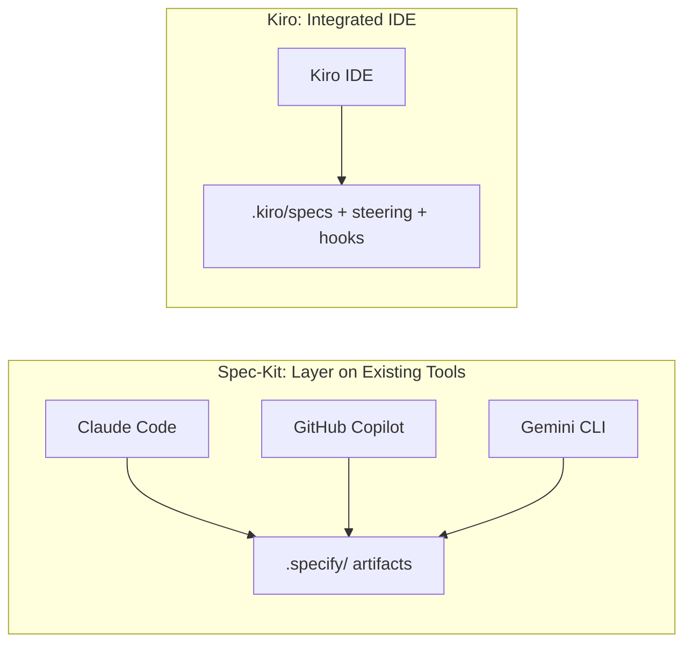

Having walked through [Spec-Kit](/posts/github-spec-kit-practical-guide/) and [Kiro](/posts/kiro-ide-specs-steering-hooks/) separately, the comparison is worth making explicit — both tools solve the same underlying problem from the [first post in this series](/posts/vibe-coding-vs-spec-driven-development/), but they disagree on almost every implementation detail.

## Core Philosophy

**Spec-Kit** is a toolkit you layer onto whichever coding agent you've already chosen. It doesn't care whether that's Claude Code, GitHub Copilot, or Gemini CLI — it produces markdown artifacts in your repo and slash commands your agent reads, and gets out of the way otherwise.

**Kiro** is a full agentic IDE — a VS Code-based editor where the spec-driven workflow, steering, and hooks aren't optional add-ons but the product itself. Adopting Kiro's spec-driven development means adopting Kiro as your editor.

## Requirements Format

Spec-Kit's `spec.md` is structured but free-form prose — a "what and why" section plus acceptance scenarios written in natural language. Kiro's `requirements.md` enforces **EARS notation** — a constrained syntax with a fixed keyword vocabulary (`WHEN`, `THE SYSTEM SHALL`, `IF/THEN`, `WHILE`, `WHERE`) borrowed from aerospace requirements engineering.

The trade-off is exactly what you'd expect from that description: EARS is more rigid and less ambiguous, at the cost of being less natural to write. Free-form prose is faster to draft and more flexible for capturing nuance, at the cost of leaving room for an agent to interpret an underspecified sentence in a way you didn't intend.

## Persistent Context

Spec-Kit centralizes project-wide standards into one document — `constitution.md`. Kiro splits the same idea across multiple **steering files**, each scoped to a concern (conventions, architecture, security). One file is simpler to keep in your head; several focused files are easier to update individually without touching unrelated context.

## Automation

This is the sharpest difference. Kiro's **hooks** fire automatically on workspace events — file save, commit opened — running linters, tests, and security scans without anyone invoking anything. Spec-Kit has no equivalent: enforcement of the constitution's principles depends on the agent adhering to them during `/speckit.implement`, backed up by whatever CI pipeline you build separately.

## Portability

Spec-Kit's artifacts are just markdown files any agent capable of reading a repository can consume — nothing locks you into one coding tool, and a team split across different agent preferences can still share the same `.specify/` structure. Kiro's steering and hooks advantages are tied to running Kiro itself; the specs it generates are portable as documents, but the automation around them isn't.

## Side-by-Side

| Dimension                 | Spec-Kit                              | Kiro                                     |
| ---------------------------- | ---------------------------------------- | -------------------------------------------- |
| **Deployment model**         | CLI toolkit layered on your agent/IDE   | Full agentic IDE                             |
| **Requirements format**      | Free-form structured prose               | EARS notation (constrained, formal)          |
| **Persistent context**       | Single constitution.md                  | Multiple steering files by concern           |
| **Automated enforcement**    | None built-in — relies on CI you build   | Native hooks on save/commit                  |
| **Agent flexibility**        | Works with any compatible coding agent   | Tied to Kiro                                 |
| **Learning curve**           | Low if you already know your agent tool  | Medium — new IDE, new notation               |
| **Best for**                 | Teams keeping their existing agent choice, valuing portability | Teams wanting integrated enforcement, comfortable adopting a new IDE |

## A Decision Framework

**Reach for Spec-Kit when:**
- Your team already has a coding agent preference and doesn't want to change it
- You need the same spec-driven discipline to work across multiple different agent tools on the same team
- You want to adopt spec discipline incrementally without an IDE migration

**Reach for Kiro when:**
- You want enforcement — linting, testing, security scanning — built in rather than assembled separately
- Your requirements are complex enough that EARS's precision is worth the extra rigor of writing in it
- You're comfortable adopting a new IDE in exchange for a more integrated workflow

## They're Not Mutually Exclusive Across a Team

Because both tools' core artifacts are just markdown, moving between them is a translation exercise, not a rewrite. A team could plausibly use Spec-Kit's `spec.md` structure for early-stage feature definition — where free-form prose is faster to iterate on — and hand off to Kiro's EARS-formatted `requirements.md` for the final, precise version before implementation. In practice, most teams pick one and standardize, but the underlying idea — a durable spec instead of an ephemeral prompt — is the same investment either way.

## Key Takeaways

1. **Spec-Kit prioritizes portability and low switching cost**; Kiro prioritizes integration and automated enforcement
2. **EARS notation trades writing ease for precision** — worth it for requirements where ambiguity is genuinely costly, overkill for a quick internal tool
3. **Hooks are Kiro's clearest differentiator** — automated enforcement Spec-Kit simply doesn't attempt to provide natively
4. **Neither tool locks you out of the underlying idea** — both artifacts are markdown, so the switching cost between them is lower than it looks
5. **Pick based on how much you value staying agent-agnostic** versus how much you value automation built into the tool itself

The series closes next with the part most teams actually need first: how to bring spec discipline into a codebase that's already vibe-coded and already in production.

---

*Part of the [Spec-Driven Development series](/tags/sdd-series/) — how agentic coding goes from vibe-coded prototypes to production-grade systems.*
