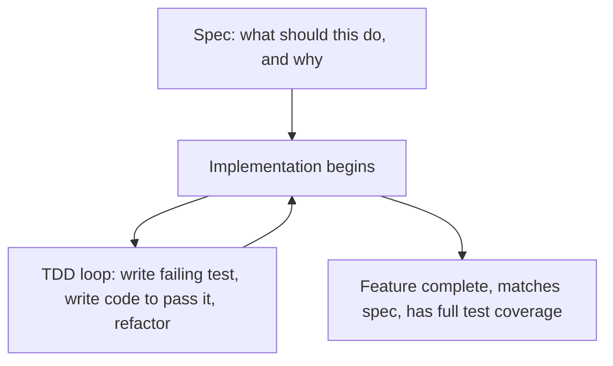

The comparison between spec-driven development and test-driven development gets framed as an either-or choice more often than the two methodologies actually warrant — they answer different questions, at different points in a development workflow, and the [spec-driven testing post](/posts/spec-driven-testing-deriving-test-cases/) earlier in this series already demonstrated how directly they combine rather than compete.

## What Each One Actually Answers

TDD answers: **"how do I know this specific piece of code, as I'm writing it, does what I intend?"** — a tight, code-level feedback loop, red-green-refactor, operating at the granularity of a function or a small unit.

SDD answers: **"what should this feature or system actually do, and why, before any code exists?"** — a higher-level, pre-implementation question about requirements and intent, independent of how the resulting code is structured or tested.



## Where They Compose Directly

A spec with checkable acceptance criteria (the standard argued for throughout this series) gives TDD's red-green loop its starting failing tests — the spec-derived tests from earlier in this series *are* the first red tests in a TDD cycle. SDD determines *what* the tests should assert; TDD determines the *discipline* of writing code against those tests incrementally, one at a time, refactoring as you go.

```python
# Spec-derived starting point (from the spec-driven testing post)
def test_expired_token_returns_410():
    token = issue_reset_token(user, issued_at=expired_time())
    response = reset_password(token, "new_pw")
    assert response.status_code == 410  # RED: not yet implemented

# TDD loop: implement just enough to go green, then refactor
```

## Where They Genuinely Diverge

TDD, in its strict form, is agnostic about upfront design — the design is meant to emerge through the refactor step, iteratively, as tests accumulate. SDD is explicitly about deciding design and behavior *before* implementation, which is closer to what strict TDD practitioners sometimes push back against as "too much upfront design." This is a real philosophical tension, not just a terminology difference — and in practice, most production codebases land somewhere between the extremes of either pure position, using a spec for the requirements-level decisions that matter and TDD's discipline for the implementation-level correctness loop.

## Why Agentic Coding Tips the Balance Toward More Upfront Spec

Strict TDD's "let the design emerge" philosophy assumes a human developer building intuition about the problem through the process of writing code and tests. An agent doesn't build that same kind of intuition across a single session the way a human does over weeks — it benefits more than a human would from an explicit spec stating design decisions upfront, precisely because it doesn't have the accumulated context a human developer would bring to an emergent-design process. This is a practical argument for leaning more spec-heavy in agentic workflows specifically, not a claim that SDD is universally superior to TDD for all development.

## Key Takeaways

1. **SDD and TDD answer different questions** — what should this do (SDD) vs. does this specific code do what I intend (TDD)
2. **Spec-derived acceptance criteria naturally become TDD's first failing tests** — they compose directly, not competitively
3. **The genuine tension is upfront design vs. emergent design** — most real codebases blend both rather than choosing one extreme
4. **Agentic coding benefits more from upfront spec than a human developer might**, since an agent doesn't accumulate the same session-to-session intuition emergent design assumes

---

*Part of the [Spec-Driven Development series](/tags/sdd-series/) — how agentic coding goes from vibe-coded prototypes to production-grade systems.*
