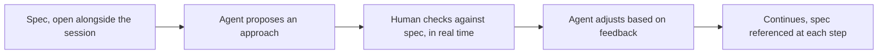

Most of this series has discussed spec-driven development in terms of an agent working with relative autonomy against a spec, checked at review time. Pair programming with an agent — actively working through a spec together, turn by turn, rather than handing off a spec and reviewing the result — is a different interaction pattern, and it's worth its own discussion because it changes what the spec is actually for in the moment.

## The Spec as a Live Reference, Not Just an Upfront Artifact



In an autonomous-agent workflow, the spec is consulted once, upfront, and checked again at review. In a pairing session, the spec functions more like a live reference both participants keep returning to — the human catching a proposed approach that drifts from a requirement immediately, in the moment, rather than after a full implementation is complete and ready for review.

## What Pairing Catches That Autonomous Review Doesn't

The earlier code-review post noted that unreviewed small deviations are easy to miss after the fact, in a completed diff. Pairing catches the same category of deviation *as it happens* — a human watching the agent propose an approach can flag "that doesn't match what the spec says about X" immediately, before the agent has built out an entire implementation around the deviation, which is both faster to correct and avoids the sunk-cost pull toward keeping a deviation because "it's already built."

## Where Pairing Is Worth the Time Investment, and Where It Isn't

Pairing is a much higher time investment per feature than reviewing an autonomously-completed implementation — it's not the right mode for routine, well-understood work where the spec is unambiguous and autonomous execution plus review is faster overall. It earns its cost specifically for: genuinely novel or architecturally significant work, work in the "dreaded module" category from earlier in this series where getting it right matters more than getting it fast, and situations where the spec itself might have gaps that only surface once implementation is actually underway.

```python
def choose_workflow_mode(task: dict) -> str:
    if task["architectural_significance"] == "high" or task["spec_confidence"] == "low":
        return "pair"
    return "autonomous_with_review"
```

## Pairing Sessions Surface Spec Gaps Live

A genuine benefit beyond catching deviations: pairing frequently surfaces spec ambiguity or gaps in real time, as the agent hits a case the spec didn't anticipate, rather than the agent silently resolving it (the risk from the agent-authored specs post) or the gap only surfacing at review. Treat these live discoveries as spec updates, not just one-off decisions for this session — the same discipline as any other spec change, captured and version-controlled rather than lost once the pairing session ends.

## Key Takeaways

1. **Pairing turns the spec into a live, continuously-referenced artifact** rather than something consulted upfront and at review only
2. **It catches deviations as they happen**, before an implementation is built around them and sunk-cost pressure sets in
3. **Reserve pairing for high-stakes or high-ambiguity work** — it's a real time investment, not the right mode for routine, well-specified tasks
4. **Capture spec gaps discovered live during pairing as actual spec updates**, not one-off decisions that disappear once the session ends

---

*Part of the [Spec-Driven Development series](/tags/sdd-series/) — how agentic coding goes from vibe-coded prototypes to production-grade systems.*
