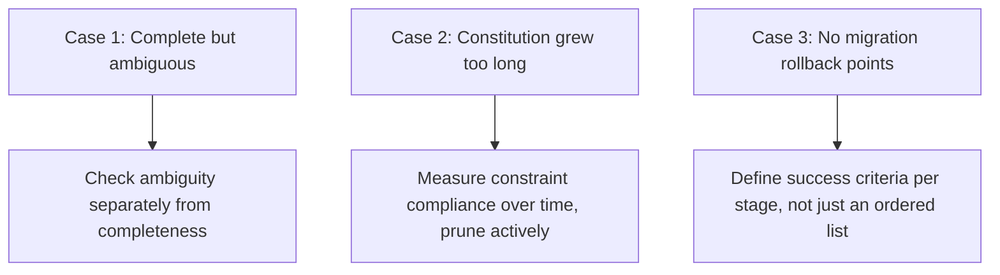

Every principle in this series has an abstract version and a concrete failure mode it's meant to prevent. These three case studies are composites of patterns that show up repeatedly, useful specifically because they're concrete enough to recognize in the moment, not just nod along with in the abstract.

## Case Study 1: The Spec That Was Complete But Ambiguous

A spec for a data export feature listed every field to include, every format to support, and every access-control rule — genuinely thorough, and the implementation still shipped with a bug: exports for accounts with more than 100k records timed out, because the spec never stated whether export should be synchronous or asynchronous, and the agent implementing it reasonably assumed synchronous for a feature described entirely in terms of "the user clicks export and gets a file."

**What went wrong**: completeness (every field, every format) was checked; ambiguity (sync vs async, an implicit assumption baked into the framing rather than stated explicitly) wasn't. This is exactly the completeness-vs-ambiguity distinction from the spec review checklist post — passing one check doesn't mean the other was checked too.

## Case Study 2: The Constitution That Got Too Long to Follow

A team's constitution grew from a lean initial document to over 40 rules across a year of additions, each individually reasonable, none ever removed. Agent sessions started reliably following the first dozen rules and inconsistently following the rest — not because the model couldn't understand them, but because a 40-rule document competing for context budget against the actual task pushed later rules into the part of context that gets attended to less reliably.

**What went wrong**: the "keep it short enough to stay prominent" guidance from the constitution-writing post was true at launch and silently stopped being true as the document grew, with no process catching the drift because nobody was measuring constitution length against actual compliance rate over time.

## Case Study 3: The Migration Spec With No Rollback Points

A legacy migration proceeded in five stages per its migration spec — solid current-behavior and target-behavior specs, but the migration spec itself just listed the five stages without defining what "safe to proceed to the next stage" meant for any of them. Stage 3 introduced a subtle data-consistency issue that wasn't caught until stage 5 was underway, by which point untangling which stage actually caused it required significant investigation.

**What went wrong**: exactly the gap the earlier legacy-migration post warned about — a migration spec needs explicit rollback points and success criteria per stage, not just an ordered list of stages. Without them, "proceed to the next stage" has no defined verification step, and problems surface far downstream of their actual cause.

## The Common Thread

None of these are failures of the spec-driven development methodology itself — each is a failure to apply a specific discipline this series already covered, drifting silently until a real incident surfaced it. Spec-driven development doesn't eliminate the need for ongoing discipline; it gives that discipline something concrete to check against, which only works if the checking actually keeps happening.

## Key Takeaways

1. **Completeness and ambiguity are genuinely separate checks** — a thorough spec can still be dangerously ambiguous on an implicit assumption
2. **A constitution's length needs active monitoring against actual compliance**, not a one-time decision to "keep it short"
3. **A migration spec needs explicit per-stage rollback and success criteria**, not just an ordered list of stages
4. **These are discipline failures, not methodology failures** — spec-driven development only works as well as the ongoing rigor applied to it

---

*Part of the [Spec-Driven Development series](/tags/sdd-series/) — how agentic coding goes from vibe-coded prototypes to production-grade systems.*
