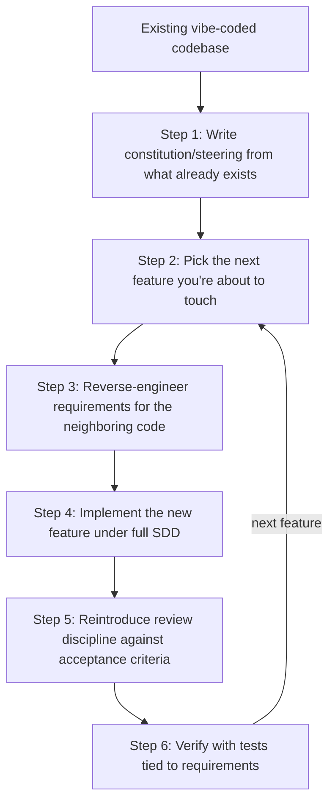

This series opened with [why vibe coding breaks down](/posts/vibe-coding-vs-spec-driven-development/) once a prototype turns into something people depend on, then walked through two concrete tools — [Spec-Kit](/posts/github-spec-kit-practical-guide/) and [Kiro](/posts/kiro-ide-specs-steering-hooks/) — that implement spec-driven development. What none of that covers is the situation most teams are actually in: a vibe-coded prototype that's already gaining real usage, with no spec anywhere, and no appetite for stopping everything to rewrite it. This is the playbook for that transition.

## The Wrong Move First

The instinct when a vibe-coded codebase starts showing strain is to treat spec-driven development as a rewrite trigger — stop feature work, spec the whole system retroactively, then resume. This is almost always a mistake. A full retroactive spec of an existing system is enormous, low-value work (you're documenting behavior nobody's questioning), and it delays the thing that actually matters — bringing discipline to the *next* changes, which is where the risk actually lives.

The migration that works treats SDD as a layer you add incrementally, prioritized by where change is actually happening, not a wholesale replacement of how the codebase got built.



## Step 1: Write the Constitution From What Already Exists

Don't start the constitution (or Kiro steering files) from a blank page — reverse-engineer it from the conventions the codebase has already settled into, even accidentally. If every route handler already calls through a `services/` layer, that's a real convention worth codifying, whether or not anyone decided it on purpose:

```markdown
# Constitution (retrofitted)

## Observed Conventions Now Made Explicit
- All database access goes through `repositories/` — true in 90% of the
  existing code; the exceptions are bugs to fix, not precedent to follow.
- API responses use the `{data, error}` envelope shape everywhere except
  the /legacy/* routes — new code follows the envelope shape; /legacy/*
  is tracked separately, not extended.
```

Calling out the exceptions explicitly — rather than pretending the codebase is more consistent than it is — matters here. An agent reading a constitution that claims a convention is universal, when it's actually violated in a third of the code, will get confused by the contradiction the first time it touches one of those files.

## Step 2: Pick One Feature, Not the Whole Codebase

The first feature under full spec-driven development should be whatever you're about to build next — not a retroactive spec for something already shipped and stable. This keeps the migration cost proportional to work you were doing anyway, rather than adding a separate project.

## Step 3: Reverse-Engineer Requirements for the Neighboring Code

New features rarely land in isolation — they extend or interact with existing, unspec'd behavior. Before writing the requirements for the new piece, write down the requirements for the existing behavior it touches, even though that behavior was never spec'd originally:

```markdown
# requirements.md — Login (reverse-engineered, existing behavior)

## Requirement 1 (existing, now documented)
WHEN a user submits valid credentials THE SYSTEM SHALL create a session
and redirect to the dashboard.

## Requirement 2 (existing, now documented)
WHEN a user submits invalid credentials THE SYSTEM SHALL show a generic
"invalid credentials" error without indicating whether the email or
password was wrong.

# requirements.md — Remember Me (new)

## Requirement 3 (new)
WHEN a user checks "remember me" during login THE SYSTEM SHALL extend the
session lifetime to 30 days instead of the default 24 hours.
```

This gives the agent a real, explicit "what and why" for the surrounding code it's about to touch, instead of having to infer existing behavior from reading implementation and hoping it inferred correctly.

## Step 4: Let Old and New Coexist Deliberately

Not every module needs retrofitting on the same timeline. Prioritize by change frequency and blast radius — a billing module touched every sprint is a much higher priority than a settings page nobody's opened in months:

| Module                  | Change Frequency | Blast Radius | Retrofit Priority |
| -------------------------- | ------------------- | ---------------- | ---------------------- |
| Billing / payments          | Weekly              | High              | Immediate               |
| Auth / login                | Monthly             | High              | Soon                    |
| Admin settings page          | Rarely              | Low               | Leave alone for now     |
| Internal reporting dashboard | Rarely              | Low               | Leave alone for now     |

A module that's stable, low-traffic, and unlikely to be touched again has close to zero ROI on retrofitting a spec — that effort is better spent on the modules actually generating risk.

## Step 5: Reintroduce Review Discipline

Part of what made vibe coding fast was "Accept All." Bringing that discipline back deliberately means reviewing diffs against the spec's acceptance criteria specifically — not a general "does this look right" pass, but a checklist: does this diff satisfy Requirement 3, without breaking Requirements 1 and 2 that it sits next to?

## Step 6: Wire In Verification

A task isn't done because the code was generated — it's done when its linked requirement has a passing test. This is the step that actually locks in the benefit of everything before it; without it, the spec is documentation that can silently drift from the code the same way vibe-coded features drifted from the original intent:

```python
def test_remember_me_extends_session_to_30_days():
    # Traces to requirements.md Requirement 3
    response = client.post("/login", json={"email": "a@b.com", "password": "x", "remember_me": True})
    session = get_session(response.cookies["session_id"])
    assert session.expires_at - session.created_at >= timedelta(days=30)

def test_default_session_still_24_hours_when_remember_me_unchecked():
    # Guards Requirement 1's existing behavior against the new feature breaking it
    response = client.post("/login", json={"email": "a@b.com", "password": "x", "remember_me": False})
    session = get_session(response.cookies["session_id"])
    assert session.expires_at - session.created_at <= timedelta(hours=24)
```

The second test matters as much as the first — verifying the new requirement without also guarding the existing, reverse-engineered one is exactly how a "remember me" feature quietly breaks default session behavior for everyone else.

## Common Mistake: Treating This as a Rewrite

Every version of this migration that's gone badly started from the same premise — that spec-driven development requires rebuilding what's already there. It doesn't. It's a documentation-and-process layer added on top of working code, one feature at a time, prioritized by where the real risk is concentrated. The codebase that results after six months of this looks the same as it would have without the migration, except that the parts touched in those six months now have a durable, versioned record of what they do and why — exactly the thing vibe coding never produced in the first place.

## Key Takeaways

1. **Don't retroactively spec the whole system** — prioritize the next feature you're building, not a rewrite of everything already shipped
2. **Reverse-engineer requirements for existing behavior your new feature touches**, even if that behavior was never spec'd originally
3. **Prioritize retrofitting by change frequency and blast radius**, not uniformly across the codebase
4. **Reintroduce review discipline against acceptance criteria specifically**, not a general "looks right" pass
5. **A task isn't done until its requirement has a passing test** — this is what keeps the spec from drifting from the code the same way vibe-coded features drifted from unwritten intent

This closes the series: from [why vibe coding stops scaling](/posts/vibe-coding-vs-spec-driven-development/), through [Spec-Kit](/posts/github-spec-kit-practical-guide/) and [Kiro](/posts/kiro-ide-specs-steering-hooks/) as concrete implementations, to actually making the transition on a codebase that already exists.

---

*Part of the [Spec-Driven Development series](/tags/sdd-series/) — how agentic coding goes from vibe-coded prototypes to production-grade systems.*
