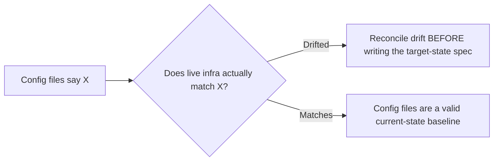

An infrastructure-as-code change — a Terraform module, a Kubernetes manifest, a cloud IAM policy — has a failure mode application code usually doesn't: getting it wrong can take down shared infrastructure other systems depend on, not just the one service being changed. This higher blast radius is a direct argument for applying spec-driven discipline here, and infrastructure specs need to cover a few things application-feature specs typically don't.

## What an Infrastructure Spec Needs Beyond the Standard Template

```markdown
## Infrastructure Change: [Name]

### Current State
[What exists today — the equivalent of the current-behavior spec for
infra, since "current state" is often as poorly documented as legacy
code behavior]

### Target State
[What should exist after this change]

### Blast Radius
- Systems that depend on what's being changed:
- Systems that would be affected if this change goes wrong:

### Rollback Plan
- [ ] Specific steps to revert, not just "terraform destroy"
- [ ] Data/state considerations (can this be cleanly reverted, or does
      it need a more careful unwind — e.g., a database that's already
      received writes under the new schema)

### Blast-Radius-Limiting Rollout
- [ ] Can this be applied to a subset of environments/regions first?
- [ ] What's the verification step before expanding?
```

The **blast radius** section is the addition that matters most, and it's frequently skipped in ad-hoc infrastructure changes — explicitly naming what depends on the thing being changed forces the author to actually think through impact before the change is applied, not discover it when something downstream breaks.

## Why Current-State Documentation Matters Even More Here

Infrastructure drift — the actual deployed state diverging from what any config file says it should be — is extremely common, through manual changes, emergency hotfixes applied directly rather than through the normal pipeline, or partial rollouts left incomplete. A spec's target state is only meaningful relative to an accurate current state, and for infrastructure specifically, that current state often needs to be verified against the actual live environment (`terraform plan` against real infra, not just against the last-applied config) rather than assumed from what the config files say.



## Rollback Needs to Account for State, Not Just Config

Application code rollback is usually a clean revert. Infrastructure rollback can be messier — a database migration applied as part of an infrastructure change may have already written data under a new schema, and "revert the Terraform" doesn't automatically undo that. The rollback plan needs to explicitly address this asymmetry rather than assuming infrastructure rollback is as clean as a git revert.

## Key Takeaways

1. **Infrastructure changes have a higher blast radius than most application changes** — a strong case for spec-driven discipline
2. **An infrastructure spec needs an explicit blast-radius section**, naming dependent systems before the change is applied
3. **Verify current state against live infrastructure, not just config files** — drift is common and undermines an inaccurate baseline
4. **Rollback plans need to account for state changes, not just config reverts** — infrastructure rollback is often messier than application rollback

---

*Part of the [Spec-Driven Development series](/tags/sdd-series/) — how agentic coding goes from vibe-coded prototypes to production-grade systems.*
