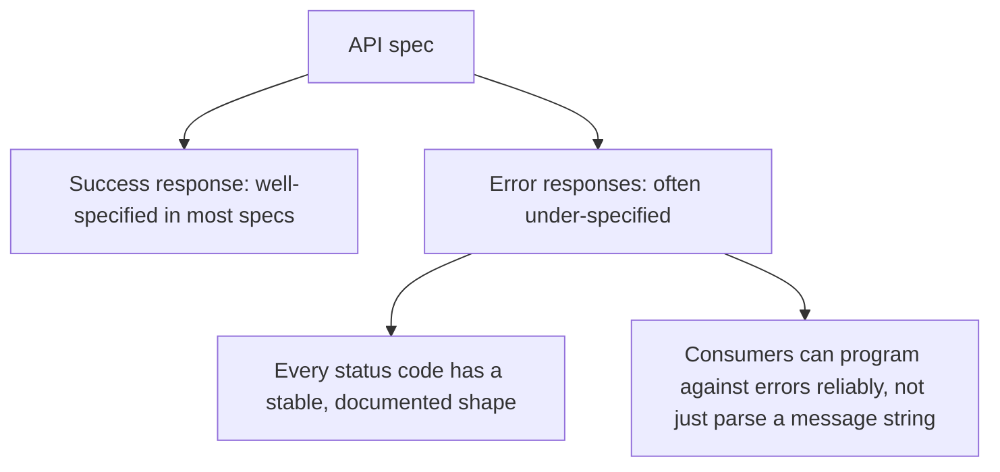

An API's contract — its request/response shapes, its error semantics, its versioning approach — is unusually expensive to change once consumers exist, compared to almost any other kind of implementation detail. A misnamed internal function is a quick refactor; a misnamed API field is a breaking change requiring consumer coordination. This asymmetry is the direct argument for specifying an API's contract deliberately before implementation, rather than letting it emerge from whatever the first implementation happens to produce.

## What an API Spec Needs to Nail Down Explicitly

```markdown
## API: POST /v1/refunds

### Request
{
  "order_id": string (required),
  "amount_cents": integer (required, must be > 0),
  "reason": enum["duplicate", "defective", "customer_request"] (required)
}

### Response (200)
{
  "refund_id": string,
  "status": enum["approved", "pending_review"],
  "estimated_completion": ISO8601 timestamp
}

### Error Responses
- 400: malformed request (see standard error catalog)
- 404: order_id not found
- 409: order already fully refunded
- 422: amount_cents exceeds remaining refundable amount

### Idempotency
- Requires an Idempotency-Key header
- Duplicate key within 24h returns the original response, not a new refund

### Versioning
- Breaking changes require a new version path (/v2/...), not a modification
  to /v1/ behavior
```

The **idempotency** and **versioning** sections are the ones most likely to get skipped in an ad-hoc implementation and the most expensive to retrofit later — an API shipped without idempotency guarantees, once consumers depend on calling it, can't safely add that guarantee without consumers potentially double-processing during the transition.

## Design the Error Semantics as Carefully as the Success Path

API specs frequently under-specify error responses relative to the success response — exactly backwards from how much consumer code actually has to handle both. Every documented error status needs a specific, stable response shape a consumer can program against reliably, not a generic 500 with a human-readable message that changes wording between implementations.



## Contract Testing Enforces What the Spec Specifies

Once an API spec exists in a checkable form (an OpenAPI schema is a natural fit here), contract tests verify the actual implementation matches the documented contract — catching drift between what's specified and what's deployed the same way the general spec-drift detection from earlier in this series catches it for behavior generally, applied specifically to the API surface.

```python
def test_refund_response_matches_openapi_schema():
    response = client.post("/v1/refunds", json=valid_refund_request)
    validate_against_schema(response.json(), openapi_spec["components"]["schemas"]["RefundResponse"])
```

## Key Takeaways

1. **An API contract is unusually expensive to change after consumers exist** — specify it deliberately before implementation, not after
2. **Idempotency and versioning are the sections most often skipped and most expensive to retrofit later**
3. **Specify error responses as carefully as success responses** — consumers need to program against errors reliably, not just parse messages
4. **Contract tests against an OpenAPI schema catch drift between the spec and the deployed API**, the same discipline as general spec-drift detection applied to the API surface

---

*Part of the [Spec-Driven Development series](/tags/sdd-series/) — how agentic coding goes from vibe-coded prototypes to production-grade systems.*
