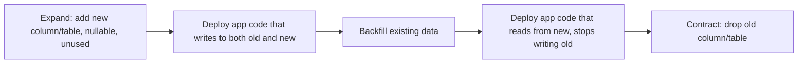

Most code changes are cleanly reversible — revert the commit, redeploy. A database migration that's run against production data is only cleanly reversible in the easy cases (adding a nullable column); the moment it involves data transformation, backfill, or a column drop, "revert" stops meaning "undo" and starts meaning "write and run a second migration, carefully, hoping the first one didn't lose information the second can't recover." This asymmetry deserves its own spec discipline, distinct from application-code changes.

## What a Migration Spec Needs to Address

```markdown
## Migration: Add `refund_status` column to `orders`

### Schema Change
[The actual DDL, or a description of it]

### Backfill Strategy
- [ ] Existing rows: how is the new column populated for data that
      already exists? Default value, computed from existing data, or
      requires a separate backfill job?
- [ ] Backfill performance: row count, estimated duration, whether it
      needs to run in batches to avoid locking the table under load

### Reversibility
- [ ] Is this migration cleanly reversible (e.g., DROP COLUMN on a new
      nullable column) or does reversal require its own careful
      migration (e.g., after a column drop, or a data transformation
      that isn't 1:1 invertible)?
- [ ] If not cleanly reversible: what's the actual rollback procedure?

### Application Coordination
- [ ] Does the application code need to deploy before, after, or
      simultaneously with this migration? (Expand-contract pattern for
      zero-downtime changes usually means: expand first, deploy app
      code that handles both old and new schema, THEN contract)
```

## The Expand-Contract Pattern, as a Spec-Level Concern



For any migration affecting a column or table actively used in production, specifying the full expand-contract sequence — not just the final schema state — is what actually determines whether the migration can happen without downtime. A spec that only describes the target schema, without the staged sequence to get there safely, leaves the riskiest part (the actual rollout coordination between schema and application code) unspecified.

## Backfill Performance Deserves Explicit Attention

A backfill that looks trivial in a spec ("populate the new column from existing data") can be a multi-hour, table-locking operation on a large production table if it's not batched. Specifying batch size, expected duration, and whether it runs online (without blocking normal traffic) or requires a maintenance window is the difference between a migration spec that's actually actionable and one that looks complete but hides a production incident in the "backfill" bullet point.

## Treat the Migration Spec as Part of the Feature Spec, Not Separate

A feature spec that requires a schema change should reference its migration spec directly, with the migration's rollout stages accounted for in the feature's own rollout plan — a feature can't safely ship ahead of the schema change it depends on, and specifying them independently risks a sequencing mismatch that only surfaces at deploy time.

## Key Takeaways

1. **Database migrations are among the least reversible changes in most codebases** — this deserves its own explicit spec discipline
2. **Specify the backfill strategy and its performance characteristics explicitly** — a trivial-looking backfill can be a production incident
3. **For zero-downtime changes, specify the full expand-contract sequence**, not just the target schema state
4. **Reference the migration spec from the feature spec that depends on it** — sequencing them independently risks a mismatch at deploy time

---

*Part of the [Spec-Driven Development series](/tags/sdd-series/) — how agentic coding goes from vibe-coded prototypes to production-grade systems.*
