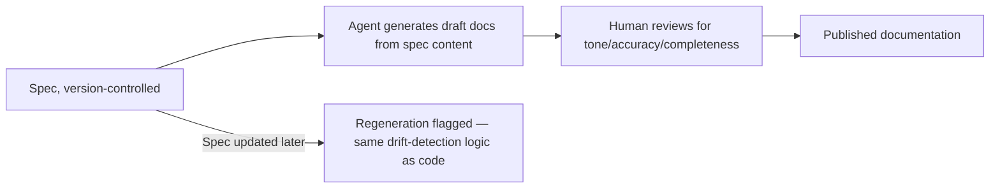

Documentation generated from code comments (docstrings, inline comments) reflects implementation detail, written from the implementer's perspective, at the time the code was written — subject to the exact same drift problem this series covered for specs generally, except usually with less discipline applied to keeping it current. If specs are being kept accurate as this series has argued they should be, they're a better source of truth for documentation than comments that live even closer to code and drift just as easily.

## Specs Already Contain What Documentation Needs

```markdown
## Spec excerpt: Password reset
- A password reset token expires 15 minutes after issuance
- Using a token twice returns an error indicating it's already been used
```

```markdown
## Generated user-facing doc
Password reset links are valid for 15 minutes after you request them.
If you click a link that's already been used, you'll need to request
a new one.
```

The transformation from spec to user-facing documentation is mostly a register change — technical/precise to accessible/friendly — which is exactly the kind of mechanical-ish transformation an agent handles well, given a well-structured spec as the source of truth rather than needing to reverse-engineer intent from code.

## A Practical Pipeline



The same drift-detection approach from earlier in this series — flag when a spec changes without a corresponding update elsewhere — applies directly to generated documentation: if a spec changes and the doc generated from it doesn't get regenerated and re-reviewed, the documentation is now stale in exactly the way code-comment-derived docs always were, just with the drift now traceable to a specific spec commit instead of being an untracked mystery.

## What This Doesn't Solve

Not every piece of documentation maps cleanly to a spec — narrative "getting started" guides, conceptual overviews explaining *why* something works the way it does rather than *what* it does, and material aimed at a very different audience than the spec's technical readers still benefit from being written directly, by a human, for that specific purpose. Spec-derived documentation is strongest for reference material — API docs, feature behavior descriptions — and weakest for narrative and conceptual content that a spec was never trying to capture in the first place.

## Internal Documentation Benefits Even More Directly

For internal-facing documentation — a wiki page describing how a feature works, aimed at engineers rather than end users — the register change from spec to doc is smaller, since the audience is closer to the spec's own technical register. This makes internal docs an even better candidate for direct spec-to-doc generation, often requiring only light editing rather than a substantial rewrite.

## Key Takeaways

1. **Specs kept accurate (this series' throughline) are a better documentation source than code comments**, which drift at least as easily with less discipline applied
2. **Generating docs from specs is mostly a register transformation** — technical/precise to accessible/friendly — which agents handle well from a good source
3. **Apply the same drift-detection discipline to generated docs**: a spec change should flag the derived documentation for regeneration
4. **This works best for reference material**; narrative and conceptual documentation still benefits from being written directly for its own purpose

---

*Part of the [Spec-Driven Development series](/tags/sdd-series/) — how agentic coding goes from vibe-coded prototypes to production-grade systems.*
