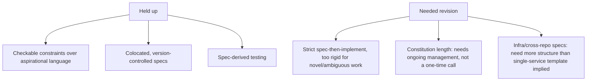

This series opened in April with [why vibe coding stops working once an agent is doing most of the writing](/posts/vibe-coding-vs-spec-driven-development/), walked through [Spec-Kit](/posts/github-spec-kit-practical-guide/) and [Kiro](/posts/kiro-ide-specs-steering-hooks/) as concrete implementations, a [comparison between them](/posts/spec-kit-vs-kiro-comparison/), a [migration playbook](/posts/vibe-coding-to-sdd-migration-playbook/), and then a full month of daily posts working through the practical discipline — constitutions, spec review, testing, versioning, multi-repo consistency, infrastructure and API and migration specs. This closes it out with what actually held up under real use versus what needed revision from the earlier, more idealized framing.

## What Held Up Without Much Revision

**Specific, checkable constraints over aspirational language** — this held up completely. Every case study of something going wrong traced back, in some form, to a constraint or requirement that wasn't concrete enough to actually check.

**Colocating specs with code in version control** — also held up cleanly. The `git blame`/PR-review benefits were real and immediate, not aspirational.

**Deriving tests from spec acceptance criteria** — worked as well in practice as the theory suggested, and became the default rather than an occasional technique.

## What Needed Revision From the Early Framing

**"Write a complete spec before any implementation" was too rigid as a universal rule.** The pairing post and the ambiguity post both pushed back on strict sequential spec-then-implement as the only valid pattern — genuinely ambiguous requirements and architecturally novel work benefit from a more interactive, spec-evolves-during-implementation approach, not a hard gate requiring full spec completion first.

**Constitution length needed active management, not a one-time decision.** The case-study post's constitution-that-grew-too-long example wasn't a hypothetical — it's a natural failure mode, and "keep it short" needed to become an ongoing practice (measuring compliance, actively pruning) rather than a launch-time guideline.

**Cross-repo and infrastructure specs needed more structure than the original template implied.** The single-repo, single-service framing from the early posts undersold how much additional structure (blast radius, expand-contract sequencing, shared contract repos) real systems need once they span multiple services and touch infrastructure.

## The Honest Summary

Spec-driven development, as actually practiced over these months, looks less like a rigid waterfall-with-extra-steps and more like a discipline for keeping intent, decisions, and behavior legible and checkable — applied with judgment about where the formality earns its cost (novel work, high blast radius, cross-team contracts) and where lighter-weight versions suffice (routine, well-understood, low-stakes changes). That's a less clean story than "always write the full spec first," and it's the one that actually held up.

## What's Next

This blog's next series shifts from how code gets written to what happens once an agentic system is operating in production — starting with [context engineering](/posts/context-engineering-replacing-prompt-engineering/), the discipline of managing what an agent actually sees at inference time.

## Key Takeaways

1. **Checkable constraints, colocated version-controlled specs, and spec-derived testing held up as strongly in practice as in theory**
2. **Strict sequential "spec fully first" was too rigid** — ambiguous and novel work benefits from a more interactive pattern
3. **Constitution length needs active, ongoing management** — it's a recurring discipline, not a one-time decision
4. **Match formality to stakes** — that's the actual throughline, more than any single rigid rule about when specs must be complete

---

*Part of the [Spec-Driven Development series](/tags/sdd-series/) — how agentic coding goes from vibe-coded prototypes to production-grade systems.*
