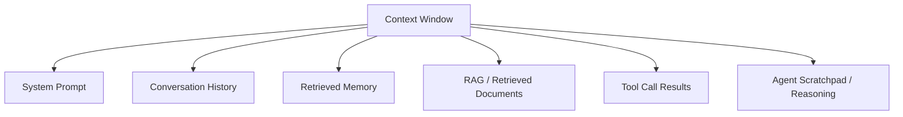

"Prompt engineering" was always a slightly too-narrow name for what production AI teams actually spend their time on. A single well-crafted prompt matters for a single-turn Q&A call. It matters a lot less once an agent is retrieving documents, calling tools, carrying conversation history, and pulling in memory from past sessions — at which point the prompt is just one of five or six inputs competing for the same context window, and the thing that actually determines whether the system works is how well you've engineered *all* of them together. That broader discipline is what the industry has started calling **context engineering**, and it's the frame this new series on agent infrastructure starts from.

## What Actually Fills the Context Window

By the time a production agent makes its Nth tool call in a session, the context window is a composite of several distinct sources, each with its own failure mode:



- **System prompt**: instructions, tool descriptions, constraints — usually static, but grows every time someone adds "oh, and also handle this edge case"
- **Conversation history**: everything said so far in this session — grows linearly and eventually needs trimming or summarizing
- **Retrieved memory**: facts pulled from a persistent store about this user or past sessions (the subject of the [next post in this series](/posts/building-production-grade-agent-memory/))
- **RAG-retrieved documents**: whatever a retrieval step pulled in for this specific query
- **Tool call results**: raw API responses, database query results, file contents
- **Scratchpad**: the agent's own intermediate reasoning from earlier steps in a multi-step trajectory

Prompt engineering optimizes the first item on this list. Context engineering optimizes the interaction between all six — because a perfectly worded system prompt still fails if it's buried under 8,000 tokens of a verbose tool result the model has to wade through to find the instruction that matters.

## Context Rot Is a Real, Measurable Failure Mode

Models don't attend to every token in a long context equally — instructions and facts placed early in a very long context are demonstrably more likely to get lost or under-weighted than the same content placed near the most recent turn. Teams running long agent sessions call this **context rot**: quality degrading not because the context window is *full*, but because it's *long*, even well within the stated token limit.

The practical symptom is an agent that behaves correctly for the first several turns of a session and then starts ignoring an instruction from the system prompt, or forgetting a constraint stated ten turns back. The fix isn't a bigger context window — it's actively managing what stays in it.

## Context Budgeting

Treat the context window as a budget with a fixed size, allocated deliberately across sources rather than filled first-come-first-served:

```python
class ContextBudget:
    def __init__(self, max_tokens: int):
        self.max_tokens = max_tokens
        self.allocations = {
            "system_prompt": 0.15,
            "memory": 0.15,
            "retrieved_docs": 0.35,
            "tool_results": 0.20,
            "conversation_history": 0.15,
        }

    def budget_for(self, source: str) -> int:
        return int(self.max_tokens * self.allocations[source])

def assemble_context(budget: ContextBudget, sources: dict[str, str], tokenizer) -> str:
    parts = []
    for source_name, content in sources.items():
        limit = budget.budget_for(source_name)
        truncated = truncate_to_tokens(content, limit, tokenizer)
        parts.append(f"[{source_name}]\n{truncated}")
    return "\n\n".join(parts)
```

The specific percentages matter less than the discipline of having them at all — without an explicit budget, whichever source happens to produce the most text (usually tool results or retrieved documents) crowds out everything else by default, not by design.

## Compaction: Summarize Before You Truncate

Naive truncation — just cutting off the oldest turns once you hit a token limit — throws away information that might matter. Compaction replaces older content with a compressed summary instead of deleting it outright:

```python
def compact_conversation_history(messages: list[dict], keep_recent: int, llm) -> list[dict]:
    if len(messages) <= keep_recent:
        return messages

    to_compact = messages[:-keep_recent]
    recent = messages[-keep_recent:]

    summary = llm.invoke(
        "Summarize this conversation history, preserving any specific facts, "
        "decisions, or constraints the user stated. Be concise but don't drop details "
        "that would matter if referenced again later.\n\n"
        + "\n".join(f"{m['role']}: {m['content']}" for m in to_compact)
    ).content

    return [{"role": "system", "content": f"[Earlier conversation summary]\n{summary}"}] + recent
```

Run compaction proactively at a threshold (say, 70% of the context budget for conversation history) rather than reactively once you've already hit the hard limit — reactive compaction under time pressure tends to be lossier than compaction done with room to spare.

## Tool Result Shaping

The same discipline from [agent skill design](/posts/agent-skill-design-patterns/) applies directly here: a tool that returns its full, unshaped API response is quietly consuming context budget that a shaped response wouldn't need.

```python
# Unshaped — burns context on fields the agent will never reason about
def get_order_raw(order_id: str) -> dict:
    return api_client.get_order(order_id)  # 40+ fields, nested objects, timestamps

# Shaped for the context budget — same information, a fraction of the tokens
def get_order_for_agent(order_id: str) -> dict:
    order = api_client.get_order(order_id)
    return {
        "order_id": order["id"],
        "status": order["fulfillment_status"],
        "total": order["total_amount"],
        "items_count": len(order["line_items"]),
    }
```

## Retrieval Relevance Over Retrieval Volume

The instinct when an agent gives a wrong answer is often to retrieve *more* — a bigger top-k, a wider search. This usually makes context rot worse, not better, by adding more low-relevance tokens for the model to wade through. The [RAG architecture patterns post](/posts/rag-architecture-patterns-production/) covers this from the retrieval side — reranking down to a small, high-precision set beats retrieving broadly and hoping the model finds the signal in the noise.

## A Context Engineering Checklist

| Practice                                | What It Prevents                                    |
| ------------------------------------------ | -------------------------------------------------------- |
| Explicit per-source token budget            | One verbose source silently crowding out everything else |
| Proactive compaction at a threshold          | Reactive, lossy summarization under a hard limit          |
| Shaped tool outputs, not raw API responses   | Context burned on fields the agent never reasons about   |
| Reranking retrieval down to high-precision top-k | Context rot from low-relevance documents diluting the signal |
| Placing critical instructions near the most recent turn | Instructions from early in a long session getting under-weighted |

## Key Takeaways

1. **Context engineering optimizes the whole window, not one string** — system prompt, history, memory, retrieval, and tool results all compete for the same budget
2. **Context rot is length-driven, not just size-driven** — a session well within the token limit can still degrade as it gets longer
3. **Budget context deliberately across sources** rather than letting whichever source produces the most text win by default
4. **Compact proactively, not reactively** — summarizing with room to spare produces better results than summarizing under a hard limit
5. **Shape every tool output for the context budget** — the same discipline that applies to agent skill design applies to every input feeding the window

This series continues with the protocol that's become the standard way agents actually get that context from tools and data sources in the first place — [MCP in production](/posts/mcp-in-production-enterprise-scale/).

---

*Part of the [Agent Infrastructure series](/tags/agent-infra-series/) — the plumbing layer underneath production agentic systems.*
