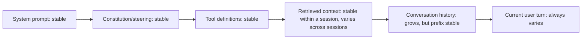

Most major LLM providers now offer prompt caching — a discount on tokens that match a previously-sent prefix, since the provider can reuse computed state rather than reprocessing from scratch. The discount is real and substantial for the cached portion, and it only applies to a prefix that's byte-for-byte identical across calls — which means the benefit depends entirely on how the prompt is structured, not just on turning the feature on.

## Cache Hit Rate Depends on Prompt Structure

```python
# Poor cache utilization: variable content placed early
def build_prompt_uncached(user_query: str, system_instructions: str) -> str:
    return f"{user_query}\n\n{system_instructions}"  # cache breaks on every unique query

# Good cache utilization: stable content first, variable content last
def build_prompt_cacheable(system_instructions: str, retrieved_context: str, user_query: str) -> str:
    # system_instructions and, often, retrieved_context are stable across many calls
    return f"{system_instructions}\n\n{retrieved_context}\n\n{user_query}"
```

The ordering matters mechanically — caching works on a matching *prefix*, so anything that varies between calls needs to go at the end, after everything stable. A prompt with variable content interspersed throughout defeats caching almost entirely, even if most of the total content is actually stable.



Structured this way, everything before the current turn can hit cache on follow-up turns within a conversation, and everything through tool definitions can hit cache across *different* conversations entirely, since system prompt and tool definitions typically don't vary per-user.

## Where the Real Savings Show Up

The biggest win is usually multi-turn conversations and agentic loops with repeated tool calls — cases where the same large system prompt, tool schema set, and often the same retrieved context get resent on every turn. A long agentic session with 15 tool-call round trips, each resending the full system prompt and tool definitions, gets the caching discount on that stable prefix for turns 2 through 15, not just turn 1.

```python
def estimate_caching_savings(stable_prefix_tokens: int, turns_per_session: int, cache_discount: float = 0.9) -> float:
    # Rough savings estimate: stable prefix reprocessed at full cost only on turn 1
    full_cost_tokens = stable_prefix_tokens * turns_per_session
    cached_cost_tokens = stable_prefix_tokens + stable_prefix_tokens * (turns_per_session - 1) * (1 - cache_discount)
    return 1 - (cached_cost_tokens / full_cost_tokens)
```

## Cache Invalidation Follows the Same Rules as Any Prefix Match

Any change to the cached prefix — even a single character in the system prompt — breaks the cache for everything after it. This is a real argument for keeping frequently-iterated content (a prompt still being actively tuned) separate from stable content, so iteration on one doesn't repeatedly invalidate caching on the other.

## Key Takeaways

1. **Prompt caching only benefits an identical prefix** — structure prompts with stable content first, variable content last, to actually get the discount
2. **Multi-turn agentic sessions with repeated tool calls see the largest real savings**, since the same stable prefix resends on every turn
3. **A single-character change anywhere in the cached prefix breaks caching for everything after it** — separate stable content from actively-iterated content
4. **This is a structural decision, not a config toggle** — enabling caching without restructuring the prompt captures little of the available benefit

---

*Part of the [Agent Infrastructure series](/tags/agent-infra-series/) — the plumbing layer underneath production agentic systems.*
